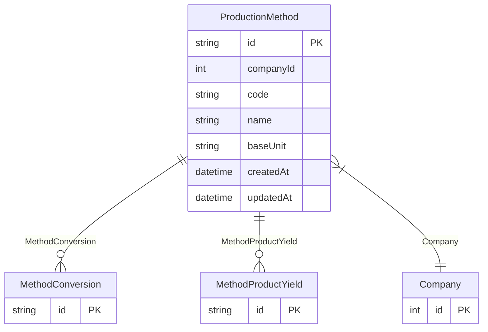

# ProductionMethod

**Schema location:** Lines 3075-3088

## Fields

| Field | Type | Required | Unique | Default | Notes |
|-------|------|----------|--------|---------|-------|
| `id` | `String` | ✅ | 🔑 PK | `` |  |
| `companyId` | `Int` | ✅ |  | `` |  |
| `code` | `String` | ✅ |  | `` |  |
| `name` | `String` | ✅ |  | `` |  |
| `baseUnit` | `String` | ✅ |  | `` |  |
| `createdAt` | `DateTime` | ✅ |  | `now(` |  |
| `updatedAt` | `DateTime` | ✅ |  | `` |  |

## Relations

| Field | Type | Cardinality | FK Fields | References | On Delete |
|-------|------|-------------|-----------|------------|-----------|
| `MethodConversion` | [MethodConversion](./models/MethodConversion.md) | One-to-Many | - | - | - |
| `MethodProductYield` | [MethodProductYield](./models/MethodProductYield.md) | One-to-Many | - | - | - |
| `Company` | [Company](./models/Company.md) | Many-to-One | companyId | id | Cascade |

## Referenced By

| Model | Field | Cardinality |
|-------|-------|-------------|
| [Company](./models/Company.md) | `ProductionMethod` | Has many |
| [MethodConversion](./models/MethodConversion.md) | `ProductionMethod` | Has one |
| [MethodProductYield](./models/MethodProductYield.md) | `ProductionMethod` | Has one |

## Unique Constraints

- `companyId, code`

## Entity Diagram

