# ProductionOrder

> Table name: `production_orders`

**Schema location:** Lines 13542-13614

## Fields

| Field | Type | Required | Unique | Default | Notes |
|-------|------|----------|--------|---------|-------|
| `id` | `Int` | ✅ | 🔑 PK | `autoincrement(` |  |
| `code` | `String` | ✅ |  | `` | "OP-2025-00001" (auto) |
| `productId` | `String` | ✅ |  | `` | Producto |
| `productVariantId` | `String?` | ❌ |  | `` | Si aplica variantes |
| `recipeId` | `String?` | ❌ |  | `` |  |
| `plannedQuantity` | `Decimal` | ✅ |  | `` | DB: Decimal(12, 4). Cantidades |
| `producedQuantity` | `Decimal` | ✅ |  | `0` | DB: Decimal(12, 4) |
| `scrapQuantity` | `Decimal` | ✅ |  | `0` | DB: Decimal(12, 4) |
| `reworkQuantity` | `Decimal` | ✅ |  | `0` | DB: Decimal(12, 4) |
| `targetUom` | `String` | ✅ |  | `` | "unidades", "m2", "metros", "toneladas" |
| `plannedCycleTimeSec` | `Int?` | ❌ |  | `` | PRO: tiempos estándar |
| `plannedSetupMinutes` | `Int?` | ❌ |  | `` |  |
| `plannedStartDate` | `DateTime` | ✅ |  | `` | Fechas |
| `plannedEndDate` | `DateTime?` | ❌ |  | `` |  |
| `actualStartDate` | `DateTime?` | ❌ |  | `` |  |
| `actualEndDate` | `DateTime?` | ❌ |  | `` |  |
| `workCenterId` | `Int?` | ❌ |  | `` | Asignación |
| `sectorId` | `Int?` | ❌ |  | `` |  |
| `responsibleId` | `Int?` | ❌ |  | `` |  |
| `status` | `String` | ✅ |  | `"DRAFT"` | Estado |
| `priority` | `String` | ✅ |  | `"NORMAL"` | DRAFT, RELEASED, IN_PROGRESS, PAUSED, COMPLETED, CANCELLED |
| `notes` | `String?` | ❌ |  | `` |  |
| `companyId` | `Int` | ✅ |  | `` |  |
| `createdById` | `Int` | ✅ |  | `` |  |
| `createdAt` | `DateTime` | ✅ |  | `now(` |  |
| `updatedAt` | `DateTime` | ✅ |  | `` |  |

## Relations

| Field | Type | Cardinality | FK Fields | References | On Delete |
|-------|------|-------------|-----------|------------|-----------|
| `product` | [CostProduct](./models/CostProduct.md) | Many-to-One | productId | id | - |
| `recipe` | [Recipe](./models/Recipe.md) | Many-to-One (optional) | recipeId | id | - |
| `workCenter` | [WorkCenter](./models/WorkCenter.md) | Many-to-One (optional) | workCenterId | id | - |
| `sector` | [Sector](./models/Sector.md) | Many-to-One (optional) | sectorId | id | - |
| `responsible` | [User](./models/User.md) | Many-to-One (optional) | responsibleId | id | - |
| `company` | [Company](./models/Company.md) | Many-to-One | companyId | id | Cascade |
| `createdBy` | [User](./models/User.md) | Many-to-One | createdById | id | - |
| `dailyReports` | [DailyProductionReport](./models/DailyProductionReport.md) | One-to-Many | - | - | - |
| `downtimes` | [ProductionDowntime](./models/ProductionDowntime.md) | One-to-Many | - | - | - |
| `qualityControls` | [ProductionQualityControl](./models/ProductionQualityControl.md) | One-to-Many | - | - | - |
| `batchLots` | [ProductionBatchLot](./models/ProductionBatchLot.md) | One-to-Many | - | - | - |
| `events` | [ProductionEvent](./models/ProductionEvent.md) | One-to-Many | - | - | - |
| `defects` | [ProductionDefect](./models/ProductionDefect.md) | One-to-Many | - | - | - |
| `curingRecords` | [CuringRecord](./models/CuringRecord.md) | One-to-Many | - | - | - |
| `stockReservations` | [StockReservation](./models/StockReservation.md) | One-to-Many | - | - | - |
| `materialRequests` | [MaterialRequest](./models/MaterialRequest.md) | One-to-Many | - | - | - |
| `despachos` | [Despacho](./models/Despacho.md) | One-to-Many | - | - | - |
| `stockMovements` | [StockMovement](./models/StockMovement.md) | One-to-Many | - | - | - |

## Referenced By

| Model | Field | Cardinality |
|-------|-------|-------------|
| [Company](./models/Company.md) | `productionOrders` | Has many |
| [User](./models/User.md) | `productionOrdersResponsible` | Has many |
| [User](./models/User.md) | `productionOrdersCreated` | Has many |
| [Sector](./models/Sector.md) | `productionOrders` | Has many |
| [CostProduct](./models/CostProduct.md) | `productionOrders` | Has many |
| [Recipe](./models/Recipe.md) | `productionOrders` | Has many |
| [StockMovement](./models/StockMovement.md) | `productionOrder` | Has one |
| [WorkCenter](./models/WorkCenter.md) | `productionOrders` | Has many |
| [DailyProductionReport](./models/DailyProductionReport.md) | `productionOrder` | Has one |
| [ProductionDowntime](./models/ProductionDowntime.md) | `productionOrder` | Has one |
| [ProductionQualityControl](./models/ProductionQualityControl.md) | `productionOrder` | Has one |
| [ProductionDefect](./models/ProductionDefect.md) | `productionOrder` | Has one |
| [ProductionBatchLot](./models/ProductionBatchLot.md) | `productionOrder` | Has one |
| [ProductionEvent](./models/ProductionEvent.md) | `productionOrder` | Has one |
| [CuringRecord](./models/CuringRecord.md) | `productionOrder` | Has one |
| [StockReservation](./models/StockReservation.md) | `productionOrder` | Has one |
| [MaterialRequest](./models/MaterialRequest.md) | `productionOrder` | Has one |
| [Despacho](./models/Despacho.md) | `productionOrder` | Has one |

## Indexes

- `companyId, status`
- `productId`
- `workCenterId`
- `plannedStartDate`

## Unique Constraints

- `companyId, code`

## Entity Diagram

```mermaid
erDiagram
    ProductionOrder {
        int id PK
        string code
        string productId
        string productVariantId
        string recipeId
        decimal plannedQuantity
        decimal producedQuantity
        decimal scrapQuantity
        decimal reworkQuantity
        string targetUom
        int plannedCycleTimeSec
        int plannedSetupMinutes
        datetime plannedStartDate
        datetime plannedEndDate
        datetime actualStartDate
        string _more_fields
    }
    CostProduct {
        string id PK
    }
    Recipe {
        string id PK
    }
    WorkCenter {
        int id PK
    }
    Sector {
        int id PK
    }
    User {
        int id PK
    }
    Company {
        int id PK
    }
    DailyProductionReport {
        int id PK
    }
    ProductionDowntime {
        int id PK
    }
    ProductionQualityControl {
        int id PK
    }
    ProductionBatchLot {
        int id PK
    }
    ProductionEvent {
        int id PK
    }
    ProductionDefect {
        int id PK
    }
    CuringRecord {
        int id PK
    }
    StockReservation {
        int id PK
    }
    MaterialRequest {
        int id PK
    }
    Despacho {
        int id PK
    }
    StockMovement {
        int id PK
    }
    ProductionOrder }|--|| CostProduct : "product"
    ProductionOrder }o--|| Recipe : "recipe"
    ProductionOrder }o--|| WorkCenter : "workCenter"
    ProductionOrder }o--|| Sector : "sector"
    ProductionOrder }o--|| User : "responsible"
    ProductionOrder }|--|| Company : "company"
    ProductionOrder }|--|| User : "createdBy"
    ProductionOrder ||--o{ DailyProductionReport : "dailyReports"
    ProductionOrder ||--o{ ProductionDowntime : "downtimes"
    ProductionOrder ||--o{ ProductionQualityControl : "qualityControls"
    ProductionOrder ||--o{ ProductionBatchLot : "batchLots"
    ProductionOrder ||--o{ ProductionEvent : "events"
    ProductionOrder ||--o{ ProductionDefect : "defects"
    ProductionOrder ||--o{ CuringRecord : "curingRecords"
    ProductionOrder ||--o{ StockReservation : "stockReservations"
    ProductionOrder ||--o{ MaterialRequest : "materialRequests"
    ProductionOrder ||--o{ Despacho : "despachos"
    ProductionOrder ||--o{ StockMovement : "stockMovements"
```

