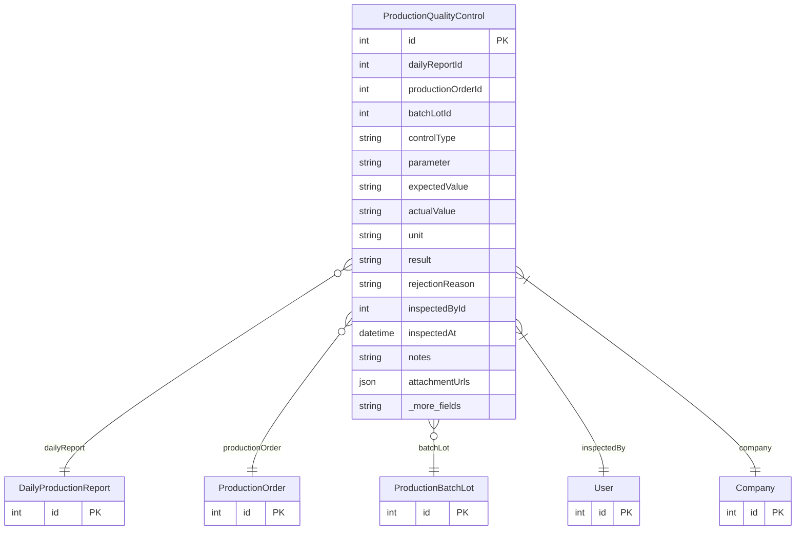

# ProductionQualityControl

> Table name: `production_quality_controls`

**Schema location:** Lines 13760-13801

## Fields

| Field | Type | Required | Unique | Default | Notes |
|-------|------|----------|--------|---------|-------|
| `id` | `Int` | ✅ | 🔑 PK | `autoincrement(` |  |
| `dailyReportId` | `Int?` | ❌ |  | `` | Contexto |
| `productionOrderId` | `Int?` | ❌ |  | `` |  |
| `batchLotId` | `Int?` | ❌ |  | `` |  |
| `controlType` | `String` | ✅ |  | `` | 'VISUAL', 'DIMENSIONAL', 'FUNCTIONAL', custom |
| `parameter` | `String?` | ❌ |  | `` | Parámetro medido |
| `expectedValue` | `String?` | ❌ |  | `` |  |
| `actualValue` | `String?` | ❌ |  | `` |  |
| `unit` | `String?` | ❌ |  | `` |  |
| `result` | `String` | ✅ |  | `` | 'APPROVED', 'REJECTED', 'HOLD', 'PENDING' |
| `rejectionReason` | `String?` | ❌ |  | `` |  |
| `inspectedById` | `Int` | ✅ |  | `` | Inspector |
| `inspectedAt` | `DateTime` | ✅ |  | `now(` |  |
| `notes` | `String?` | ❌ |  | `` | Evidencia |
| `attachmentUrls` | `Json?` | ❌ |  | `` |  |
| `companyId` | `Int` | ✅ |  | `` |  |
| `createdAt` | `DateTime` | ✅ |  | `now(` |  |
| `updatedAt` | `DateTime` | ✅ |  | `` |  |

## Relations

| Field | Type | Cardinality | FK Fields | References | On Delete |
|-------|------|-------------|-----------|------------|-----------|
| `dailyReport` | [DailyProductionReport](./models/DailyProductionReport.md) | Many-to-One (optional) | dailyReportId | id | - |
| `productionOrder` | [ProductionOrder](./models/ProductionOrder.md) | Many-to-One (optional) | productionOrderId | id | - |
| `batchLot` | [ProductionBatchLot](./models/ProductionBatchLot.md) | Many-to-One (optional) | batchLotId | id | - |
| `inspectedBy` | [User](./models/User.md) | Many-to-One | inspectedById | id | - |
| `company` | [Company](./models/Company.md) | Many-to-One | companyId | id | Cascade |

## Referenced By

| Model | Field | Cardinality |
|-------|-------|-------------|
| [Company](./models/Company.md) | `productionQualityControls` | Has many |
| [User](./models/User.md) | `productionQCInspected` | Has many |
| [ProductionOrder](./models/ProductionOrder.md) | `qualityControls` | Has many |
| [DailyProductionReport](./models/DailyProductionReport.md) | `qualityControls` | Has many |
| [ProductionBatchLot](./models/ProductionBatchLot.md) | `qualityControls` | Has many |

## Indexes

- `productionOrderId`
- `batchLotId`
- `result`

## Entity Diagram

