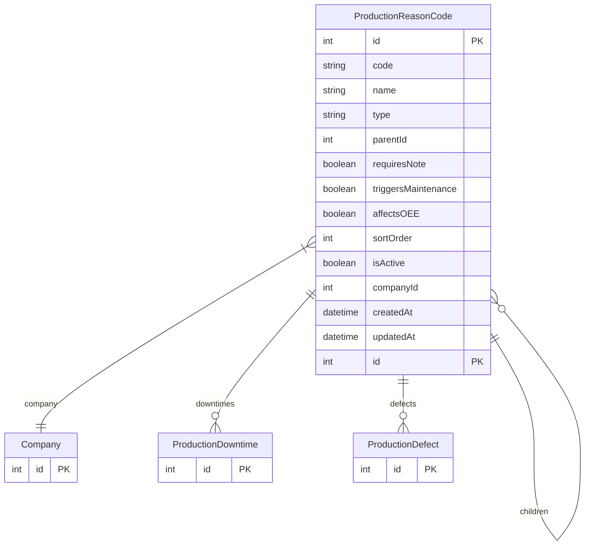

# ProductionReasonCode

> Table name: `production_reason_codes`

**Schema location:** Lines 13508-13539

## Fields

| Field | Type | Required | Unique | Default | Notes |
|-------|------|----------|--------|---------|-------|
| `id` | `Int` | ✅ | 🔑 PK | `autoincrement(` |  |
| `code` | `String` | ✅ |  | `` |  |
| `name` | `String` | ✅ |  | `` |  |
| `type` | `String` | ✅ |  | `` | 'DOWNTIME', 'SCRAP', 'REWORK', 'QUALITY_HOLD' |
| `parentId` | `Int?` | ❌ |  | `` | Jerarquía: categoría → motivo → submotivo |
| `requiresNote` | `Boolean` | ✅ |  | `false` | Comportamiento |
| `triggersMaintenance` | `Boolean` | ✅ |  | `false` | Si true, sugiere crear OT |
| `affectsOEE` | `Boolean` | ✅ |  | `true` |  |
| `sortOrder` | `Int` | ✅ |  | `0` | Orden de display |
| `isActive` | `Boolean` | ✅ |  | `true` |  |
| `companyId` | `Int` | ✅ |  | `` |  |
| `createdAt` | `DateTime` | ✅ |  | `now(` |  |
| `updatedAt` | `DateTime` | ✅ |  | `` |  |

## Relations

| Field | Type | Cardinality | FK Fields | References | On Delete |
|-------|------|-------------|-----------|------------|-----------|
| `parent` | [ProductionReasonCode](./models/ProductionReasonCode.md) | Many-to-One (optional) | parentId | id | - |
| `children` | [ProductionReasonCode](./models/ProductionReasonCode.md) | One-to-Many | - | - | - |
| `company` | [Company](./models/Company.md) | Many-to-One | companyId | id | Cascade |
| `downtimes` | [ProductionDowntime](./models/ProductionDowntime.md) | One-to-Many | - | - | - |
| `defects` | [ProductionDefect](./models/ProductionDefect.md) | One-to-Many | - | - | - |

## Referenced By

| Model | Field | Cardinality |
|-------|-------|-------------|
| [Company](./models/Company.md) | `productionReasonCodes` | Has many |
| [ProductionDowntime](./models/ProductionDowntime.md) | `reasonCode` | Has one |
| [ProductionDefect](./models/ProductionDefect.md) | `reasonCode` | Has one |

## Indexes

- `companyId, type, isActive`

## Unique Constraints

- `companyId, code`

## Entity Diagram

