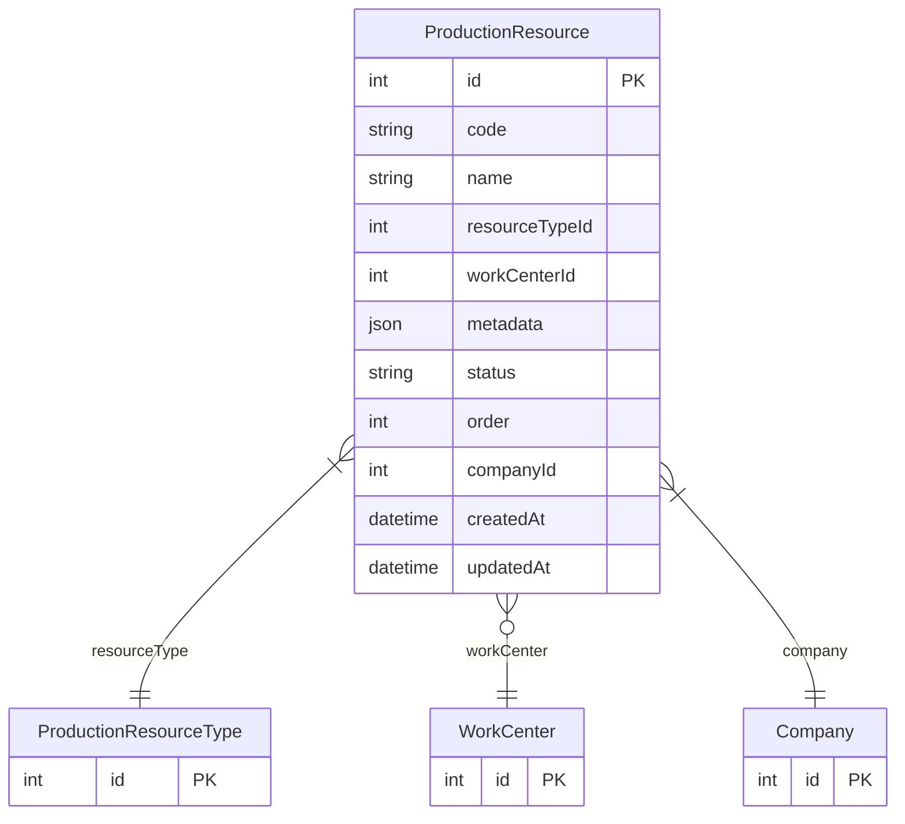

# ProductionResource

> Table name: `production_resources`

**Schema location:** Lines 14100-14127

## Fields

| Field | Type | Required | Unique | Default | Notes |
|-------|------|----------|--------|---------|-------|
| `id` | `Int` | ✅ | 🔑 PK | `autoincrement(` |  |
| `code` | `String` | ✅ |  | `` | "BANCO_01", "SILO_A" |
| `name` | `String` | ✅ |  | `` | "Banco 1", "Silo A" |
| `resourceTypeId` | `Int` | ✅ |  | `` |  |
| `workCenterId` | `Int?` | ❌ |  | `` |  |
| `metadata` | `Json?` | ❌ |  | `` | { "largo": 100, "capacidad": 50 } |
| `status` | `String` | ✅ |  | `"ACTIVE"` | ACTIVE, MAINTENANCE, INACTIVE |
| `order` | `Int` | ✅ |  | `0` |  |
| `companyId` | `Int` | ✅ |  | `` |  |
| `createdAt` | `DateTime` | ✅ |  | `now(` |  |
| `updatedAt` | `DateTime` | ✅ |  | `` |  |

## Relations

| Field | Type | Cardinality | FK Fields | References | On Delete |
|-------|------|-------------|-----------|------------|-----------|
| `resourceType` | [ProductionResourceType](./models/ProductionResourceType.md) | Many-to-One | resourceTypeId | id | - |
| `workCenter` | [WorkCenter](./models/WorkCenter.md) | Many-to-One (optional) | workCenterId | id | - |
| `company` | [Company](./models/Company.md) | Many-to-One | companyId | id | Cascade |

## Referenced By

| Model | Field | Cardinality |
|-------|-------|-------------|
| [Company](./models/Company.md) | `productionResources` | Has many |
| [WorkCenter](./models/WorkCenter.md) | `productionResources` | Has many |
| [ProductionResourceType](./models/ProductionResourceType.md) | `resources` | Has many |

## Indexes

- `companyId, resourceTypeId`
- `companyId, status`

## Unique Constraints

- `companyId, code`

## Entity Diagram

