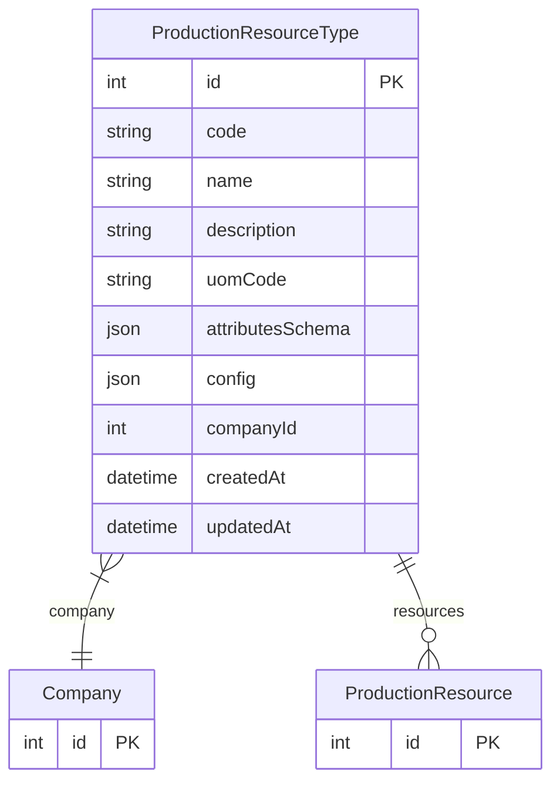

# ProductionResourceType

> Table name: `production_resource_types`

**Schema location:** Lines 14074-14097

## Fields

| Field | Type | Required | Unique | Default | Notes |
|-------|------|----------|--------|---------|-------|
| `id` | `Int` | ✅ | 🔑 PK | `autoincrement(` |  |
| `code` | `String` | ✅ |  | `` | "BANCO", "SILO", "ESTACION" |
| `name` | `String` | ✅ |  | `` | "Banco de Pretensado", "Silo de Cemento" |
| `description` | `String?` | ❌ |  | `` |  |
| `uomCode` | `String?` | ❌ |  | `` | "m", "tn", "m3", "u" |
| `attributesSchema` | `Json?` | ❌ |  | `` | { "largo": { type: "number", label: "Largo", unit: "m" }, ... } |
| `config` | `Json?` | ❌ |  | `` | { "requiresPhotos": true, "hasCapacity": true, "hasOrder": true } |
| `companyId` | `Int` | ✅ |  | `` |  |
| `createdAt` | `DateTime` | ✅ |  | `now(` |  |
| `updatedAt` | `DateTime` | ✅ |  | `` |  |

## Relations

| Field | Type | Cardinality | FK Fields | References | On Delete |
|-------|------|-------------|-----------|------------|-----------|
| `company` | [Company](./models/Company.md) | Many-to-One | companyId | id | Cascade |
| `resources` | [ProductionResource](./models/ProductionResource.md) | One-to-Many | - | - | - |

## Referenced By

| Model | Field | Cardinality |
|-------|-------|-------------|
| [Company](./models/Company.md) | `productionResourceTypes` | Has many |
| [ProductionResource](./models/ProductionResource.md) | `resourceType` | Has one |

## Indexes

- `companyId`

## Unique Constraints

- `companyId, code`

## Entity Diagram

