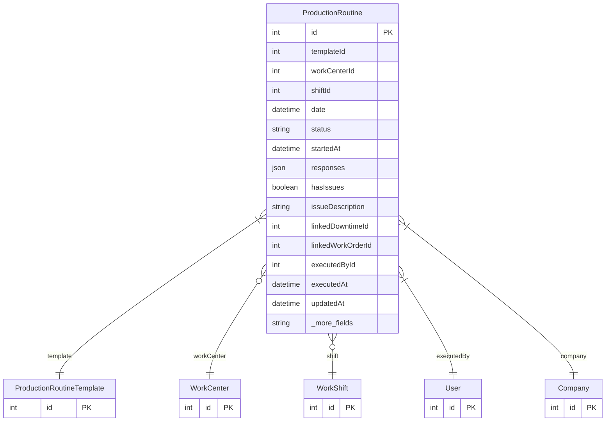

# ProductionRoutine

> Table name: `production_routines`

**Schema location:** Lines 13967-14011

## Fields

| Field | Type | Required | Unique | Default | Notes |
|-------|------|----------|--------|---------|-------|
| `id` | `Int` | ✅ | 🔑 PK | `autoincrement(` |  |
| `templateId` | `Int` | ✅ |  | `` |  |
| `workCenterId` | `Int?` | ❌ |  | `` |  |
| `shiftId` | `Int?` | ❌ |  | `` |  |
| `date` | `DateTime` | ✅ |  | `` | DB: Date |
| `status` | `String` | ✅ |  | `"COMPLETED"` | 'DRAFT', 'COMPLETED' |
| `startedAt` | `DateTime` | ✅ |  | `now(` |  |
| `responses` | `Json` | ✅ |  | `` | [{itemId, value, notes, photoUrl}] |
| `hasIssues` | `Boolean` | ✅ |  | `false` | Si hay problema |
| `issueDescription` | `String?` | ❌ |  | `` |  |
| `linkedDowntimeId` | `Int?` | ❌ |  | `` | Si derivó en parada |
| `linkedWorkOrderId` | `Int?` | ❌ |  | `` | Si derivó en OT de mantenimiento |
| `executedById` | `Int` | ✅ |  | `` |  |
| `executedAt` | `DateTime` | ✅ |  | `now(` |  |
| `updatedAt` | `DateTime` | ✅ |  | `` | Control de draft/reminders |
| `lastReminderAt` | `DateTime?` | ❌ |  | `` |  |
| `reminderCount` | `Int` | ✅ |  | `0` |  |
| `companyId` | `Int` | ✅ |  | `` |  |

## Relations

| Field | Type | Cardinality | FK Fields | References | On Delete |
|-------|------|-------------|-----------|------------|-----------|
| `template` | [ProductionRoutineTemplate](./models/ProductionRoutineTemplate.md) | Many-to-One | templateId | id | - |
| `workCenter` | [WorkCenter](./models/WorkCenter.md) | Many-to-One (optional) | workCenterId | id | - |
| `shift` | [WorkShift](./models/WorkShift.md) | Many-to-One (optional) | shiftId | id | - |
| `executedBy` | [User](./models/User.md) | Many-to-One | executedById | id | - |
| `company` | [Company](./models/Company.md) | Many-to-One | companyId | id | Cascade |

## Referenced By

| Model | Field | Cardinality |
|-------|-------|-------------|
| [Company](./models/Company.md) | `productionRoutines` | Has many |
| [User](./models/User.md) | `productionRoutinesExecuted` | Has many |
| [WorkShift](./models/WorkShift.md) | `routines` | Has many |
| [WorkCenter](./models/WorkCenter.md) | `routines` | Has many |
| [ProductionRoutineTemplate](./models/ProductionRoutineTemplate.md) | `executions` | Has many |

## Indexes

- `companyId, date`
- `companyId, status`
- `templateId`

## Entity Diagram

