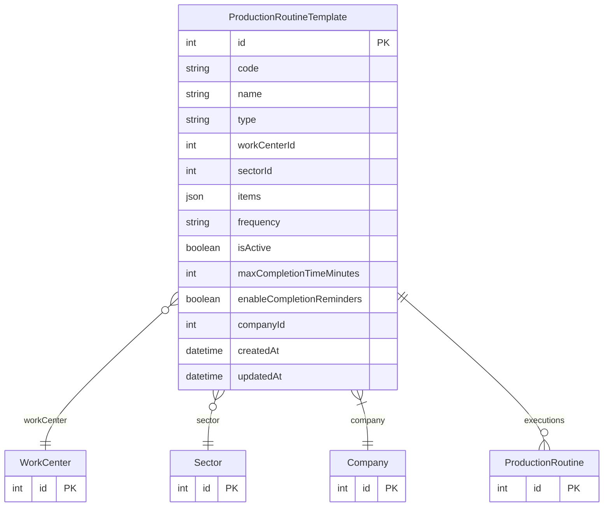

# ProductionRoutineTemplate

> Table name: `production_routine_templates`

**Schema location:** Lines 13928-13964

## Fields

| Field | Type | Required | Unique | Default | Notes |
|-------|------|----------|--------|---------|-------|
| `id` | `Int` | ✅ | 🔑 PK | `autoincrement(` |  |
| `code` | `String` | ✅ |  | `` |  |
| `name` | `String` | ✅ |  | `` |  |
| `type` | `String` | ✅ |  | `` | 'SHIFT_START', 'SHIFT_END', 'SETUP', 'SAFETY', '5S' |
| `workCenterId` | `Int?` | ❌ |  | `` | Aplica a |
| `sectorId` | `Int?` | ❌ |  | `` | Sector (para filtrar empleados en ejecución) |
| `items` | `Json` | ✅ |  | `` | [{id, description, type: 'CHECK'|'VALUE'|'TEXT', required}] |
| `frequency` | `String` | ✅ |  | `"EVERY_SHIFT"` | 'EVERY_SHIFT', 'DAILY', 'WEEKLY' |
| `isActive` | `Boolean` | ✅ |  | `true` |  |
| `maxCompletionTimeMinutes` | `Int?` | ❌ |  | `` | Configuración de tiempos de completado |
| `enableCompletionReminders` | `Boolean` | ✅ |  | `false` |  |
| `companyId` | `Int` | ✅ |  | `` |  |
| `createdAt` | `DateTime` | ✅ |  | `now(` |  |
| `updatedAt` | `DateTime` | ✅ |  | `` |  |

## Relations

| Field | Type | Cardinality | FK Fields | References | On Delete |
|-------|------|-------------|-----------|------------|-----------|
| `workCenter` | [WorkCenter](./models/WorkCenter.md) | Many-to-One (optional) | workCenterId | id | - |
| `sector` | [Sector](./models/Sector.md) | Many-to-One (optional) | sectorId | id | - |
| `company` | [Company](./models/Company.md) | Many-to-One | companyId | id | Cascade |
| `executions` | [ProductionRoutine](./models/ProductionRoutine.md) | One-to-Many | - | - | - |

## Referenced By

| Model | Field | Cardinality |
|-------|-------|-------------|
| [Company](./models/Company.md) | `productionRoutineTemplates` | Has many |
| [Sector](./models/Sector.md) | `routineTemplates` | Has many |
| [WorkCenter](./models/WorkCenter.md) | `routineTemplates` | Has many |
| [ProductionRoutine](./models/ProductionRoutine.md) | `template` | Has one |

## Indexes

- `companyId, isActive`

## Unique Constraints

- `companyId, code`

## Entity Diagram

