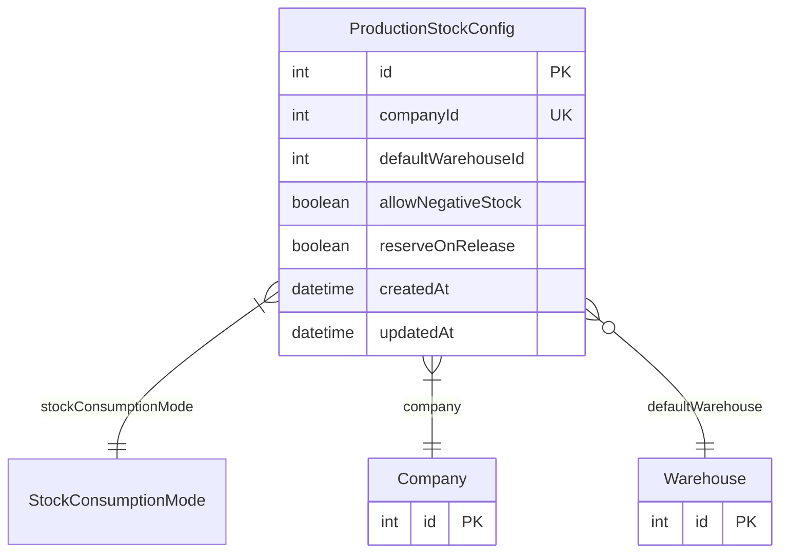

# ProductionStockConfig

> Table name: `production_stock_configs`

**Schema location:** Lines 14897-14913

## Fields

| Field | Type | Required | Unique | Default | Notes |
|-------|------|----------|--------|---------|-------|
| `id` | `Int` | ✅ | 🔑 PK | `autoincrement(` |  |
| `companyId` | `Int` | ✅ | ✅ | `` |  |
| `defaultWarehouseId` | `Int?` | ❌ |  | `` |  |
| `allowNegativeStock` | `Boolean` | ✅ |  | `false` |  |
| `reserveOnRelease` | `Boolean` | ✅ |  | `true` |  |
| `createdAt` | `DateTime` | ✅ |  | `now(` |  |
| `updatedAt` | `DateTime` | ✅ |  | `` |  |

## Relations

| Field | Type | Cardinality | FK Fields | References | On Delete |
|-------|------|-------------|-----------|------------|-----------|
| `stockConsumptionMode` | [StockConsumptionMode](./models/StockConsumptionMode.md) | Many-to-One | - | - | - |
| `company` | [Company](./models/Company.md) | Many-to-One | companyId | id | Cascade |
| `defaultWarehouse` | [Warehouse](./models/Warehouse.md) | Many-to-One (optional) | defaultWarehouseId | id | - |

## Referenced By

| Model | Field | Cardinality |
|-------|-------|-------------|
| [Company](./models/Company.md) | `productionStockConfig` | Has one |
| [Warehouse](./models/Warehouse.md) | `productionStockConfigs` | Has many |

## Entity Diagram

