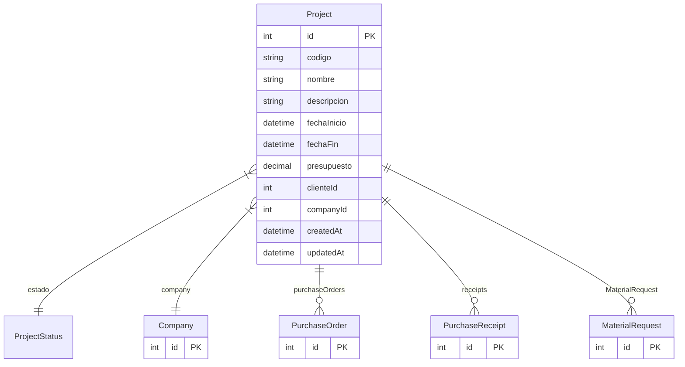

# Project

> Table name: `projects`

**Schema location:** Lines 7305-7328

## Fields

| Field | Type | Required | Unique | Default | Notes |
|-------|------|----------|--------|---------|-------|
| `id` | `Int` | ✅ | 🔑 PK | `autoincrement(` |  |
| `codigo` | `String` | ✅ |  | `` | DB: VarChar(50) |
| `nombre` | `String` | ✅ |  | `` | DB: VarChar(255) |
| `descripcion` | `String?` | ❌ |  | `` |  |
| `fechaInicio` | `DateTime?` | ❌ |  | `` | DB: Date |
| `fechaFin` | `DateTime?` | ❌ |  | `` | DB: Date |
| `presupuesto` | `Decimal?` | ❌ |  | `` | DB: Decimal(15, 2) |
| `clienteId` | `Int?` | ❌ |  | `` | Si aplica |
| `companyId` | `Int` | ✅ |  | `` |  |
| `createdAt` | `DateTime` | ✅ |  | `now(` |  |
| `updatedAt` | `DateTime` | ✅ |  | `` |  |

## Relations

| Field | Type | Cardinality | FK Fields | References | On Delete |
|-------|------|-------------|-----------|------------|-----------|
| `estado` | [ProjectStatus](./models/ProjectStatus.md) | Many-to-One | - | - | - |
| `company` | [Company](./models/Company.md) | Many-to-One | companyId | id | Cascade |
| `purchaseOrders` | [PurchaseOrder](./models/PurchaseOrder.md) | One-to-Many | - | - | - |
| `receipts` | [PurchaseReceipt](./models/PurchaseReceipt.md) | One-to-Many | - | - | - |
| `MaterialRequest` | [MaterialRequest](./models/MaterialRequest.md) | One-to-Many | - | - | - |

## Referenced By

| Model | Field | Cardinality |
|-------|-------|-------------|
| [Company](./models/Company.md) | `projects` | Has many |
| [PurchaseReceipt](./models/PurchaseReceipt.md) | `project` | Has one |
| [PurchaseOrder](./models/PurchaseOrder.md) | `project` | Has one |
| [MaterialRequest](./models/MaterialRequest.md) | `proyecto` | Has one |

## Indexes

- `companyId`
- `estado`

## Unique Constraints

- `companyId, codigo`

## Entity Diagram

