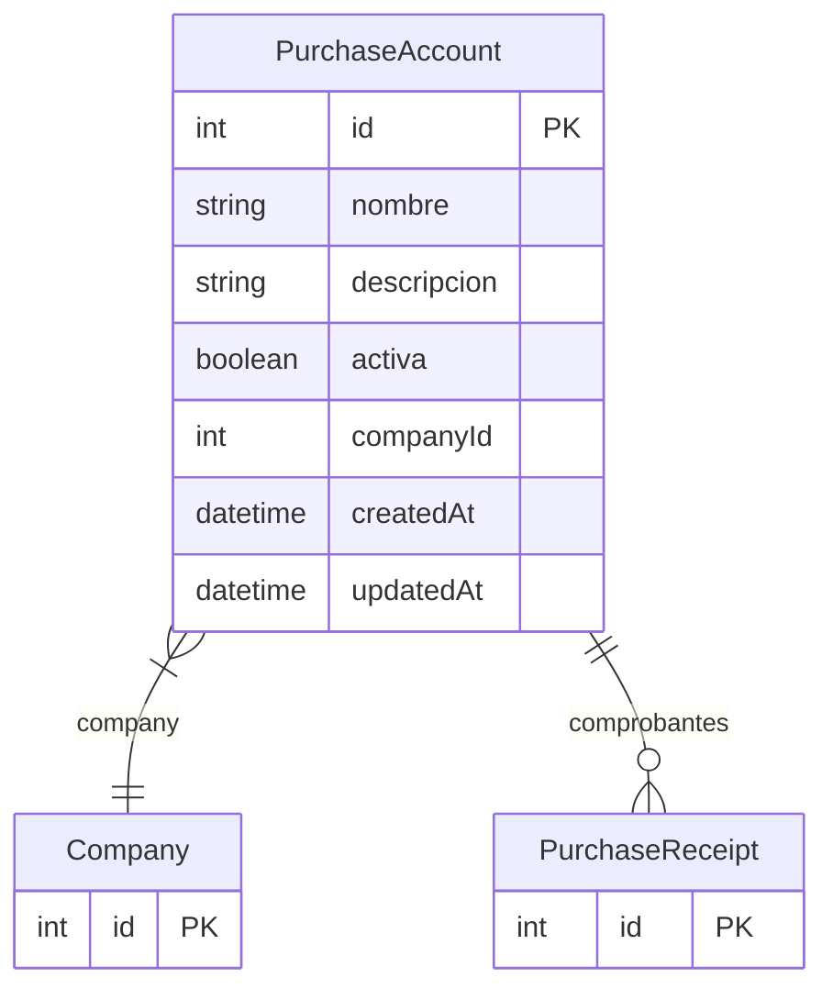

# PurchaseAccount

> Table name: `PurchaseAccount`

**Schema location:** Lines 4565-4579

## Fields

| Field | Type | Required | Unique | Default | Notes |
|-------|------|----------|--------|---------|-------|
| `id` | `Int` | ✅ | 🔑 PK | `autoincrement(` |  |
| `nombre` | `String` | ✅ |  | `` | DB: VarChar(255) |
| `descripcion` | `String?` | ❌ |  | `` |  |
| `activa` | `Boolean` | ✅ |  | `true` |  |
| `companyId` | `Int` | ✅ |  | `` |  |
| `createdAt` | `DateTime` | ✅ |  | `now(` |  |
| `updatedAt` | `DateTime` | ✅ |  | `` |  |

## Relations

| Field | Type | Cardinality | FK Fields | References | On Delete |
|-------|------|-------------|-----------|------------|-----------|
| `company` | [Company](./models/Company.md) | Many-to-One | companyId | id | Cascade |
| `comprobantes` | [PurchaseReceipt](./models/PurchaseReceipt.md) | One-to-Many | - | - | - |

## Referenced By

| Model | Field | Cardinality |
|-------|-------|-------------|
| [Company](./models/Company.md) | `purchaseAccounts` | Has many |
| [PurchaseReceipt](./models/PurchaseReceipt.md) | `tipoCuenta` | Has one |

## Indexes

- `companyId`
- `activa`

## Entity Diagram

