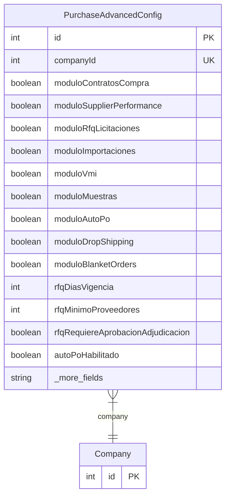

# PurchaseAdvancedConfig

> Table name: `purchase_config`

**Schema location:** Lines 15199-15237

## Fields

| Field | Type | Required | Unique | Default | Notes |
|-------|------|----------|--------|---------|-------|
| `id` | `Int` | ✅ | 🔑 PK | `autoincrement(` |  |
| `companyId` | `Int` | ✅ | ✅ | `` |  |
| `moduloContratosCompra` | `Boolean` | ✅ |  | `false` | Módulos habilitados |
| `moduloSupplierPerformance` | `Boolean` | ✅ |  | `false` |  |
| `moduloRfqLicitaciones` | `Boolean` | ✅ |  | `false` |  |
| `moduloImportaciones` | `Boolean` | ✅ |  | `false` |  |
| `moduloVmi` | `Boolean` | ✅ |  | `false` |  |
| `moduloMuestras` | `Boolean` | ✅ |  | `false` |  |
| `moduloAutoPo` | `Boolean` | ✅ |  | `false` |  |
| `moduloDropShipping` | `Boolean` | ✅ |  | `false` |  |
| `moduloBlanketOrders` | `Boolean` | ✅ |  | `false` |  |
| `rfqDiasVigencia` | `Int` | ✅ |  | `15` | Configuración RFQ |
| `rfqMinimoProveedores` | `Int` | ✅ |  | `3` |  |
| `rfqRequiereAprobacionAdjudicacion` | `Boolean` | ✅ |  | `true` |  |
| `autoPoHabilitado` | `Boolean` | ✅ |  | `false` | Configuración Auto-PO |
| `autoPoStockMinimoTrigger` | `Boolean` | ✅ |  | `true` |  |
| `autoPoRequiereAprobacion` | `Boolean` | ✅ |  | `true` |  |
| `spmHabilitado` | `Boolean` | ✅ |  | `false` | Configuración Supplier Performance |
| `spmPeriodoEvaluacionMeses` | `Int` | ✅ |  | `3` |  |
| `spmPesoCalidad` | `Decimal` | ✅ |  | `40` | DB: Decimal(5, 2) |
| `spmPesoEntrega` | `Decimal` | ✅ |  | `40` | DB: Decimal(5, 2) |
| `spmPesoPrecio` | `Decimal` | ✅ |  | `20` | DB: Decimal(5, 2) |
| `createdAt` | `DateTime` | ✅ |  | `now(` |  |
| `updatedAt` | `DateTime` | ✅ |  | `` |  |

## Relations

| Field | Type | Cardinality | FK Fields | References | On Delete |
|-------|------|-------------|-----------|------------|-----------|
| `company` | [Company](./models/Company.md) | Many-to-One | companyId | id | Cascade |

## Referenced By

| Model | Field | Cardinality |
|-------|-------|-------------|
| [Company](./models/Company.md) | `purchaseAdvancedConfig` | Has one |

## Entity Diagram

