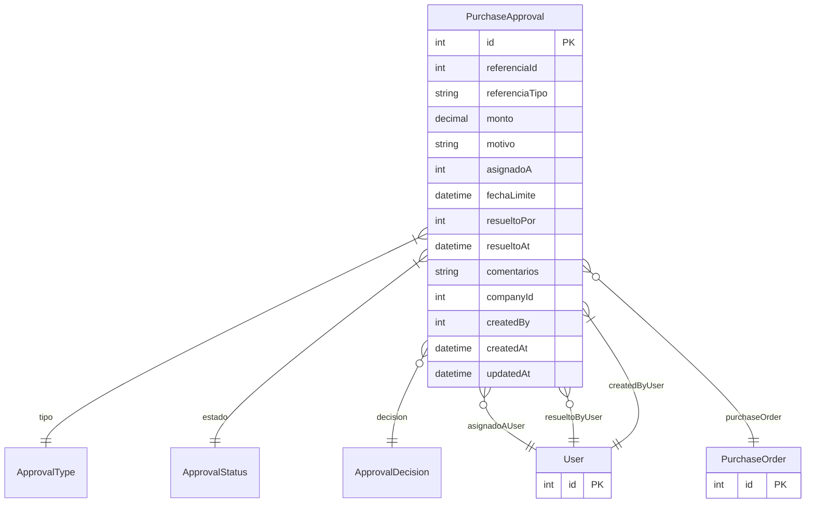

# PurchaseApproval

> Table name: `purchase_approvals`

**Schema location:** Lines 7222-7255

## Fields

| Field | Type | Required | Unique | Default | Notes |
|-------|------|----------|--------|---------|-------|
| `id` | `Int` | ✅ | 🔑 PK | `autoincrement(` |  |
| `referenciaId` | `Int` | ✅ |  | `` | ID del documento a aprobar |
| `referenciaTipo` | `String` | ✅ |  | `` | DB: VarChar(50). purchase_order, goods_receipt, etc |
| `monto` | `Decimal?` | ❌ |  | `` | DB: Decimal(15, 2) |
| `motivo` | `String?` | ❌ |  | `` | Motivo de la solicitud de aprobación |
| `asignadoA` | `Int?` | ❌ |  | `` | Asignación |
| `fechaLimite` | `DateTime?` | ❌ |  | `` |  |
| `resueltoPor` | `Int?` | ❌ |  | `` | Resolución |
| `resueltoAt` | `DateTime?` | ❌ |  | `` |  |
| `comentarios` | `String?` | ❌ |  | `` |  |
| `companyId` | `Int` | ✅ |  | `` | Tracking |
| `createdBy` | `Int` | ✅ |  | `` |  |
| `createdAt` | `DateTime` | ✅ |  | `now(` |  |
| `updatedAt` | `DateTime` | ✅ |  | `` |  |

## Relations

| Field | Type | Cardinality | FK Fields | References | On Delete |
|-------|------|-------------|-----------|------------|-----------|
| `tipo` | [ApprovalType](./models/ApprovalType.md) | Many-to-One | - | - | - |
| `estado` | [ApprovalStatus](./models/ApprovalStatus.md) | Many-to-One | - | - | - |
| `decision` | [ApprovalDecision](./models/ApprovalDecision.md) | Many-to-One (optional) | - | - | - |
| `asignadoAUser` | [User](./models/User.md) | Many-to-One (optional) | asignadoA | id | - |
| `resueltoByUser` | [User](./models/User.md) | Many-to-One (optional) | resueltoPor | id | - |
| `createdByUser` | [User](./models/User.md) | Many-to-One | createdBy | id | - |
| `purchaseOrder` | [PurchaseOrder](./models/PurchaseOrder.md) | Many-to-One (optional) | referenciaId | id | - |

## Referenced By

| Model | Field | Cardinality |
|-------|-------|-------------|
| [User](./models/User.md) | `approvalsAssigned` | Has many |
| [User](./models/User.md) | `approvalsResolved` | Has many |
| [User](./models/User.md) | `approvalsCreated` | Has many |
| [PurchaseOrder](./models/PurchaseOrder.md) | `approvals` | Has many |

## Indexes

- `companyId`
- `tipo`
- `estado`
- `asignadoA`
- `referenciaId, referenciaTipo`

## Entity Diagram

