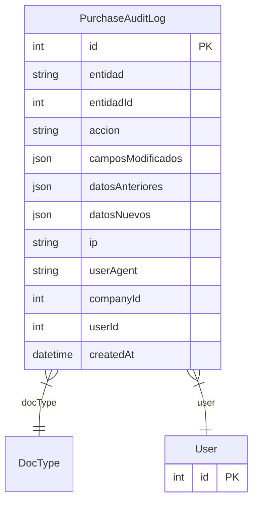

# PurchaseAuditLog

> Table name: `purchase_audit_logs`

**Schema location:** Lines 7640-7665

## Fields

| Field | Type | Required | Unique | Default | Notes |
|-------|------|----------|--------|---------|-------|
| `id` | `Int` | ✅ | 🔑 PK | `autoincrement(` |  |
| `entidad` | `String` | ✅ |  | `` | DB: VarChar(100). purchase_order, goods_receipt, etc |
| `entidadId` | `Int` | ✅ |  | `` |  |
| `accion` | `String` | ✅ |  | `` | DB: VarChar(50). CREATE, UPDATE, DELETE, APPROVE, REJECT, etc |
| `camposModificados` | `Json?` | ❌ |  | `` | {campo: {old: x, new: y}} |
| `datosAnteriores` | `Json?` | ❌ |  | `` |  |
| `datosNuevos` | `Json?` | ❌ |  | `` |  |
| `ip` | `String?` | ❌ |  | `` | DB: VarChar(50) |
| `userAgent` | `String?` | ❌ |  | `` |  |
| `companyId` | `Int` | ✅ |  | `` |  |
| `userId` | `Int` | ✅ |  | `` |  |
| `createdAt` | `DateTime` | ✅ |  | `now(` |  |

## Relations

| Field | Type | Cardinality | FK Fields | References | On Delete |
|-------|------|-------------|-----------|------------|-----------|
| `docType` | [DocType](./models/DocType.md) | Many-to-One | - | - | - |
| `user` | [User](./models/User.md) | Many-to-One | userId | id | - |

## Referenced By

| Model | Field | Cardinality |
|-------|-------|-------------|
| [User](./models/User.md) | `purchaseAuditLogs` | Has many |

## Indexes

- `companyId`
- `entidad, entidadId`
- `userId`
- `createdAt`
- `docType`
- `companyId, docType`

## Entity Diagram

