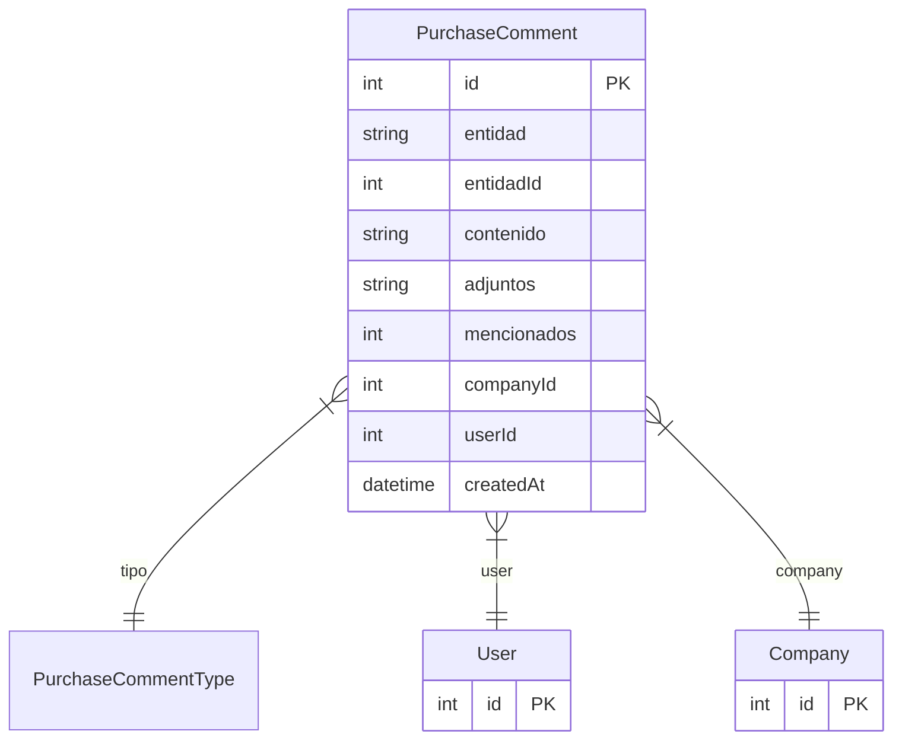

# PurchaseComment

> Table name: `purchase_comments`

**Schema location:** Lines 7950-7971

## Fields

| Field | Type | Required | Unique | Default | Notes |
|-------|------|----------|--------|---------|-------|
| `id` | `Int` | ✅ | 🔑 PK | `autoincrement(` |  |
| `entidad` | `String` | ✅ |  | `` | DB: VarChar(50). "request", "quotation", "order" |
| `entidadId` | `Int` | ✅ |  | `` |  |
| `contenido` | `String` | ✅ |  | `` |  |
| `adjuntos` | `String[]` | ✅ |  | `` |  |
| `mencionados` | `Int[]` | ✅ |  | `` | IDs de usuarios mencionados |
| `companyId` | `Int` | ✅ |  | `` | Multi-tenant |
| `userId` | `Int` | ✅ |  | `` |  |
| `createdAt` | `DateTime` | ✅ |  | `now(` |  |

## Relations

| Field | Type | Cardinality | FK Fields | References | On Delete |
|-------|------|-------------|-----------|------------|-----------|
| `tipo` | [PurchaseCommentType](./models/PurchaseCommentType.md) | Many-to-One | - | - | - |
| `user` | [User](./models/User.md) | Many-to-One | userId | id | - |
| `company` | [Company](./models/Company.md) | Many-to-One | companyId | id | Cascade |

## Referenced By

| Model | Field | Cardinality |
|-------|-------|-------------|
| [Company](./models/Company.md) | `purchaseComments` | Has many |
| [User](./models/User.md) | `purchaseComments` | Has many |

## Indexes

- `entidad, entidadId`
- `companyId`
- `createdAt`

## Entity Diagram

