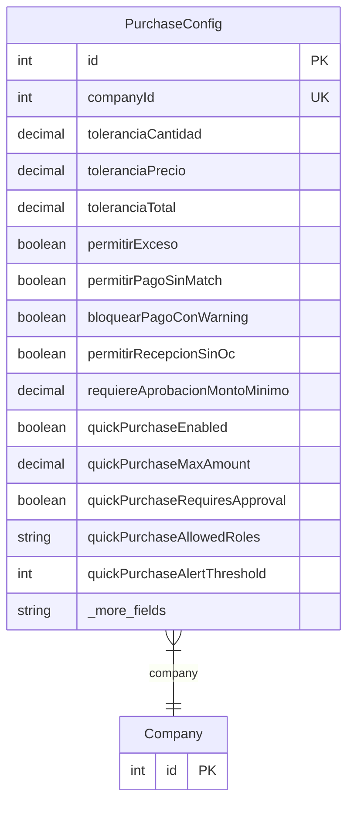

# PurchaseConfig

> Table name: `purchase_configs`

**Schema location:** Lines 7057-7097

## Fields

| Field | Type | Required | Unique | Default | Notes |
|-------|------|----------|--------|---------|-------|
| `id` | `Int` | ✅ | 🔑 PK | `autoincrement(` |  |
| `companyId` | `Int` | ✅ | ✅ | `` |  |
| `toleranciaCantidad` | `Decimal` | ✅ |  | `5` | DB: Decimal(5, 2). Tolerancias de cantidad (%) |
| `toleranciaPrecio` | `Decimal` | ✅ |  | `2` | DB: Decimal(5, 2). Tolerancias de precio (%) |
| `toleranciaTotal` | `Decimal` | ✅ |  | `1` | DB: Decimal(5, 2). Tolerancia de total (%) |
| `permitirExceso` | `Boolean` | ✅ |  | `false` | ¿Permitir recibir más de lo pedido? |
| `permitirPagoSinMatch` | `Boolean` | ✅ |  | `false` |  |
| `bloquearPagoConWarning` | `Boolean` | ✅ |  | `false` | ¿Bloquear pago si hay warning? |
| `permitirRecepcionSinOc` | `Boolean` | ✅ |  | `true` |  |
| `requiereAprobacionMontoMinimo` | `Decimal?` | ❌ |  | `` | DB: Decimal(15, 2) |
| `quickPurchaseEnabled` | `Boolean` | ✅ |  | `true` | Política de Compras Rápidas |
| `quickPurchaseMaxAmount` | `Decimal?` | ❌ |  | `` | DB: Decimal(15, 2). Monto máximo sin aprobación |
| `quickPurchaseRequiresApproval` | `Boolean` | ✅ |  | `false` | Requiere aprobación extra |
| `quickPurchaseAllowedRoles` | `String[]` | ✅ |  | `` | Roles que pueden crear compras rápidas |
| `quickPurchaseAlertThreshold` | `Int` | ✅ |  | `3` | Alertar si un usuario hace X en 7 días |
| `quickPurchaseRequireJustification` | `Boolean` | ✅ |  | `true` | Motivo obligatorio |
| `umbralAprobacionPedido` | `Decimal` | ✅ |  | `50000` | DB: Decimal(15, 2). Monto mínimo para requerir aprobación de pedido |
| `umbralDobleAprobacion` | `Decimal` | ✅ |  | `500000` | DB: Decimal(15, 2). Monto mínimo para doble aprobación de pago |
| `permitirPagoSinRecepcion` | `Boolean` | ✅ |  | `false` | ¿Permitir pagar sin recepción confirmada? |
| `diasAlertaRecepcionSinFactura` | `Int` | ✅ |  | `7` | Días para alertas |
| `diasAlertaFacturaVencer` | `Int` | ✅ |  | `7` |  |
| `diasLimiteRegularizacion` | `Int` | ✅ |  | `15` |  |
| `iaAutoMatch` | `Boolean` | ✅ |  | `false` | IA |
| `iaConfianzaMinima` | `Decimal` | ✅ |  | `80` | DB: Decimal(5, 2). % mínimo de confianza |
| `createdAt` | `DateTime` | ✅ |  | `now(` |  |
| `updatedAt` | `DateTime` | ✅ |  | `` |  |

## Relations

| Field | Type | Cardinality | FK Fields | References | On Delete |
|-------|------|-------------|-----------|------------|-----------|
| `company` | [Company](./models/Company.md) | Many-to-One | companyId | id | Cascade |

## Referenced By

| Model | Field | Cardinality |
|-------|-------|-------------|
| [Company](./models/Company.md) | `purchaseConfig` | Has one |

## Entity Diagram

