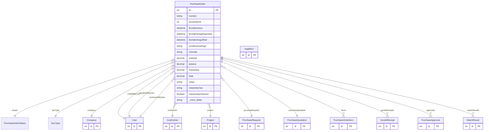

# PurchaseOrder

> Table name: `purchase_orders`

**Schema location:** Lines 6383-6448

## Fields

| Field | Type | Required | Unique | Default | Notes |
|-------|------|----------|--------|---------|-------|
| `id` | `Int` | ✅ | 🔑 PK | `autoincrement(` |  |
| `numero` | `String` | ✅ |  | `` | DB: VarChar(50) |
| `proveedorId` | `Int` | ✅ |  | `` |  |
| `fechaEmision` | `DateTime` | ✅ |  | `` | DB: Date |
| `fechaEntregaEsperada` | `DateTime?` | ❌ |  | `` | DB: Date |
| `fechaEntregaReal` | `DateTime?` | ❌ |  | `` | DB: Date |
| `condicionesPago` | `String?` | ❌ |  | `` | DB: VarChar(255) |
| `moneda` | `String` | ✅ |  | `"ARS"` | DB: VarChar(10) |
| `subtotal` | `Decimal` | ✅ |  | `` | DB: Decimal(15, 2) |
| `tasaIva` | `Decimal` | ✅ |  | `21` | DB: Decimal(5, 2). Porcentaje IVA configurable (21, 10.5, 0) |
| `impuestos` | `Decimal` | ✅ |  | `0` | DB: Decimal(15, 2) |
| `total` | `Decimal` | ✅ |  | `` | DB: Decimal(15, 2) |
| `notas` | `String?` | ❌ |  | `` |  |
| `notasInternas` | `String?` | ❌ |  | `` |  |
| `requiereAprobacion` | `Boolean` | ✅ |  | `false` | Campos para aprobación |
| `aprobadoPor` | `Int?` | ❌ |  | `` |  |
| `aprobadoAt` | `DateTime?` | ❌ |  | `` |  |
| `rechazadoPor` | `Int?` | ❌ |  | `` |  |
| `rechazadoAt` | `DateTime?` | ❌ |  | `` |  |
| `motivoRechazo` | `String?` | ❌ |  | `` |  |
| `costCenterId` | `Int?` | ❌ |  | `` | Centro de costo |
| `projectId` | `Int?` | ❌ |  | `` |  |
| `esEmergencia` | `Boolean` | ✅ |  | `false` | Campos de emergencia |
| `motivoEmergencia` | `String?` | ❌ |  | `` |  |
| `tipoCuentaId` | `Int?` | ❌ |  | `` | Tipo de cuenta/gasto pre-seleccionado (opcional, para cuando se cargue la factura) |
| `purchaseRequestId` | `Int?` | ❌ |  | `` | Solicitud que originó esta OC |
| `purchaseQuotationId` | `Int?` | ❌ |  | `` | Cotización seleccionada |
| `companyId` | `Int` | ✅ |  | `` | Tracking |
| `createdBy` | `Int` | ✅ |  | `` |  |
| `createdAt` | `DateTime` | ✅ |  | `now(` |  |
| `updatedAt` | `DateTime` | ✅ |  | `` |  |
| `proveedor` | `suppliers` | ✅ |  | `` |  |

## Relations

| Field | Type | Cardinality | FK Fields | References | On Delete |
|-------|------|-------------|-----------|------------|-----------|
| `estado` | [PurchaseOrderStatus](./models/PurchaseOrderStatus.md) | Many-to-One | - | - | - |
| `docType` | [DocType](./models/DocType.md) | Many-to-One | - | - | - |
| `company` | [Company](./models/Company.md) | Many-to-One | companyId | id | Cascade |
| `createdByUser` | [User](./models/User.md) | Many-to-One | createdBy | id | - |
| `aprobadoByUser` | [User](./models/User.md) | Many-to-One (optional) | aprobadoPor | id | - |
| `rechazadoByUser` | [User](./models/User.md) | Many-to-One (optional) | rechazadoPor | id | - |
| `costCenter` | [CostCenter](./models/CostCenter.md) | Many-to-One (optional) | costCenterId | id | - |
| `project` | [Project](./models/Project.md) | Many-to-One (optional) | projectId | id | - |
| `purchaseRequest` | [PurchaseRequest](./models/PurchaseRequest.md) | Many-to-One (optional) | purchaseRequestId | id | - |
| `purchaseQuotation` | [PurchaseQuotation](./models/PurchaseQuotation.md) | Many-to-One (optional) | purchaseQuotationId | id | - |
| `items` | [PurchaseOrderItem](./models/PurchaseOrderItem.md) | One-to-Many | - | - | - |
| `goodsReceipts` | [GoodsReceipt](./models/GoodsReceipt.md) | One-to-Many | - | - | - |
| `approvals` | [PurchaseApproval](./models/PurchaseApproval.md) | One-to-Many | - | - | - |
| `matchResults` | [MatchResult](./models/MatchResult.md) | One-to-Many | - | - | - |

## Referenced By

| Model | Field | Cardinality |
|-------|-------|-------------|
| [Company](./models/Company.md) | `purchaseOrders` | Has many |
| [User](./models/User.md) | `purchaseOrdersCreated` | Has many |
| [User](./models/User.md) | `purchaseOrdersApproved` | Has many |
| [User](./models/User.md) | `purchaseOrdersRejected` | Has many |
| [suppliers](./models/suppliers.md) | `purchaseOrders` | Has many |
| [PurchaseOrderItem](./models/PurchaseOrderItem.md) | `purchaseOrder` | Has one |
| [GoodsReceipt](./models/GoodsReceipt.md) | `purchaseOrder` | Has one |
| [MatchResult](./models/MatchResult.md) | `purchaseOrder` | Has one |
| [PurchaseApproval](./models/PurchaseApproval.md) | `purchaseOrder` | Has one |
| [CostCenter](./models/CostCenter.md) | `purchaseOrders` | Has many |
| [Project](./models/Project.md) | `purchaseOrders` | Has many |
| [PurchaseRequest](./models/PurchaseRequest.md) | `purchaseOrders` | Has many |
| [PurchaseQuotation](./models/PurchaseQuotation.md) | `purchaseOrders` | Has many |

## Indexes

- `companyId`
- `proveedorId`
- `estado`
- `fechaEmision`
- `esEmergencia`
- `docType`
- `companyId, docType`

## Unique Constraints

- `companyId, numero`

## Entity Diagram

