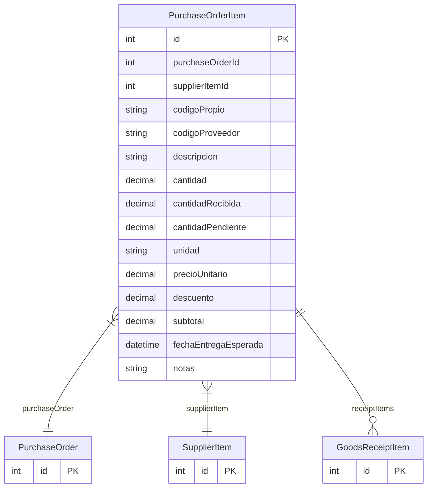

# PurchaseOrderItem

> Table name: `purchase_order_items`

**Schema location:** Lines 6450-6474

## Fields

| Field | Type | Required | Unique | Default | Notes |
|-------|------|----------|--------|---------|-------|
| `id` | `Int` | ✅ | 🔑 PK | `autoincrement(` |  |
| `purchaseOrderId` | `Int` | ✅ |  | `` |  |
| `supplierItemId` | `Int` | ✅ |  | `` |  |
| `codigoPropio` | `String?` | ❌ |  | `` | DB: VarChar(50). Código interno nuestro |
| `codigoProveedor` | `String?` | ❌ |  | `` | DB: VarChar(50). Código del proveedor |
| `descripcion` | `String` | ✅ |  | `` | DB: VarChar(255) |
| `cantidad` | `Decimal` | ✅ |  | `` | DB: Decimal(15, 4) |
| `cantidadRecibida` | `Decimal` | ✅ |  | `0` | DB: Decimal(15, 4) |
| `cantidadPendiente` | `Decimal` | ✅ |  | `` | DB: Decimal(15, 4) |
| `unidad` | `String` | ✅ |  | `` | DB: VarChar(50) |
| `precioUnitario` | `Decimal` | ✅ |  | `` | DB: Decimal(15, 2) |
| `descuento` | `Decimal` | ✅ |  | `0` | DB: Decimal(5, 2). Porcentaje |
| `subtotal` | `Decimal` | ✅ |  | `` | DB: Decimal(15, 2) |
| `fechaEntregaEsperada` | `DateTime?` | ❌ |  | `` | DB: Date |
| `notas` | `String?` | ❌ |  | `` |  |

## Relations

| Field | Type | Cardinality | FK Fields | References | On Delete |
|-------|------|-------------|-----------|------------|-----------|
| `purchaseOrder` | [PurchaseOrder](./models/PurchaseOrder.md) | Many-to-One | purchaseOrderId | id | Cascade |
| `supplierItem` | [SupplierItem](./models/SupplierItem.md) | Many-to-One | supplierItemId | id | - |
| `receiptItems` | [GoodsReceiptItem](./models/GoodsReceiptItem.md) | One-to-Many | - | - | - |

## Referenced By

| Model | Field | Cardinality |
|-------|-------|-------------|
| [SupplierItem](./models/SupplierItem.md) | `purchaseOrderItems` | Has many |
| [PurchaseOrder](./models/PurchaseOrder.md) | `items` | Has many |
| [GoodsReceiptItem](./models/GoodsReceiptItem.md) | `purchaseOrderItem` | Has one |

## Indexes

- `purchaseOrderId`
- `supplierItemId`

## Entity Diagram

