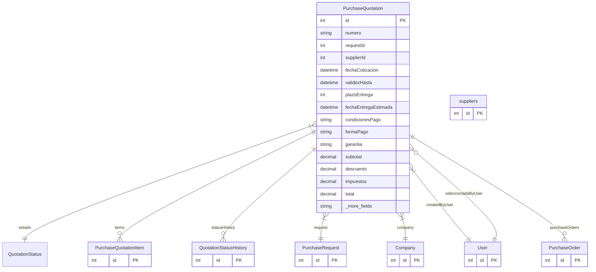

# PurchaseQuotation

> Table name: `purchase_quotations`

**Schema location:** Lines 7785-7858

## Fields

| Field | Type | Required | Unique | Default | Notes |
|-------|------|----------|--------|---------|-------|
| `id` | `Int` | ✅ | 🔑 PK | `autoincrement(` |  |
| `numero` | `String` | ✅ |  | `` | DB: VarChar(50). COT-2026-00001 |
| `requestId` | `Int` | ✅ |  | `` | Solicitud de origen |
| `supplierId` | `Int` | ✅ |  | `` | Proveedor que cotiza |
| `fechaCotizacion` | `DateTime` | ✅ |  | `` | DB: Date. Fechas |
| `validezHasta` | `DateTime?` | ❌ |  | `` | DB: Date |
| `plazoEntrega` | `Int?` | ❌ |  | `` | Días |
| `fechaEntregaEstimada` | `DateTime?` | ❌ |  | `` | DB: Date |
| `condicionesPago` | `String?` | ❌ |  | `` | DB: VarChar(200). Condiciones |
| `formaPago` | `String?` | ❌ |  | `` | DB: VarChar(100) |
| `garantia` | `String?` | ❌ |  | `` | DB: VarChar(200) |
| `subtotal` | `Decimal` | ✅ |  | `` | DB: Decimal(15, 2). Totales |
| `descuento` | `Decimal` | ✅ |  | `0` | DB: Decimal(15, 2) |
| `impuestos` | `Decimal` | ✅ |  | `` | DB: Decimal(15, 2) |
| `total` | `Decimal` | ✅ |  | `` | DB: Decimal(15, 2) |
| `moneda` | `String` | ✅ |  | `"ARS"` | DB: VarChar(10) |
| `exchangeRate` | `Decimal?` | ❌ |  | `` | DB: Decimal(15, 4). TC al momento de cargar (si USD) |
| `pricesIncludeVat` | `Boolean` | ✅ |  | `false` | IVA configurable |
| `vatRate` | `Decimal` | ✅ |  | `21` | DB: Decimal(5, 2). 21, 10.5, 0 |
| `shippingCost` | `Decimal` | ✅ |  | `0` | DB: Decimal(15, 2). Costos adicionales |
| `otherCosts` | `Decimal` | ✅ |  | `0` | DB: Decimal(15, 2) |
| `otherCostsDesc` | `String?` | ❌ |  | `` | DB: VarChar(200) |
| `beneficios` | `String?` | ❌ |  | `` | "Entrega inmediata", "Mejor precio", etc. |
| `observaciones` | `String?` | ❌ |  | `` |  |
| `adjuntos` | `String[]` | ✅ |  | `` | PDF de cotización del proveedor |
| `esSeleccionada` | `Boolean` | ✅ |  | `false` | Selección/Aprobación (REGLA: solo 1 cotización seleccionada por request) |
| `seleccionadaPor` | `Int?` | ❌ |  | `` |  |
| `seleccionadaAt` | `DateTime?` | ❌ |  | `` |  |
| `motivoSeleccion` | `String?` | ❌ |  | `` | Por qué se eligió esta |
| `receivedAt` | `DateTime?` | ❌ |  | `` | Cuando pasó a RECIBIDA |
| `convertedAt` | `DateTime?` | ❌ |  | `` | Cuando se convirtió a OC |
| `expiredAt` | `DateTime?` | ❌ |  | `` | Cuando se marcó como vencida |
| `notSelectedReason` | `String?` | ❌ |  | `` | DB: VarChar(100). "another_selected", "price_too_high", etc. |
| `isExpired` | `Boolean` | ✅ |  | `false` | true si pasó validez |
| `companyId` | `Int` | ✅ |  | `` | Multi-tenant |
| `createdBy` | `Int` | ✅ |  | `` |  |
| `createdAt` | `DateTime` | ✅ |  | `now(` |  |
| `updatedAt` | `DateTime` | ✅ |  | `` |  |
| `supplier` | `suppliers` | ✅ |  | `` |  |

## Relations

| Field | Type | Cardinality | FK Fields | References | On Delete |
|-------|------|-------------|-----------|------------|-----------|
| `estado` | [QuotationStatus](./models/QuotationStatus.md) | Many-to-One | - | - | - |
| `items` | [PurchaseQuotationItem](./models/PurchaseQuotationItem.md) | One-to-Many | - | - | - |
| `statusHistory` | [QuotationStatusHistory](./models/QuotationStatusHistory.md) | One-to-Many | - | - | - |
| `request` | [PurchaseRequest](./models/PurchaseRequest.md) | Many-to-One | requestId | id | - |
| `company` | [Company](./models/Company.md) | Many-to-One | companyId | id | Cascade |
| `createdByUser` | [User](./models/User.md) | Many-to-One | createdBy | id | - |
| `seleccionadaByUser` | [User](./models/User.md) | Many-to-One (optional) | seleccionadaPor | id | - |
| `purchaseOrders` | [PurchaseOrder](./models/PurchaseOrder.md) | One-to-Many | - | - | - |

## Referenced By

| Model | Field | Cardinality |
|-------|-------|-------------|
| [Company](./models/Company.md) | `purchaseQuotations` | Has many |
| [User](./models/User.md) | `quotationsCreated` | Has many |
| [User](./models/User.md) | `quotationsSelected` | Has many |
| [suppliers](./models/suppliers.md) | `purchaseQuotations` | Has many |
| [PurchaseOrder](./models/PurchaseOrder.md) | `purchaseQuotation` | Has one |
| [PurchaseRequest](./models/PurchaseRequest.md) | `quotations` | Has many |
| [PurchaseQuotationItem](./models/PurchaseQuotationItem.md) | `quotation` | Has one |
| [QuotationStatusHistory](./models/QuotationStatusHistory.md) | `quotation` | Has one |

## Indexes

- `requestId`
- `supplierId`
- `companyId`
- `estado`
- `companyId, estado, createdAt`
- `companyId, validezHasta`
- `requestId, estado`

## Unique Constraints

- `companyId, numero`

## Entity Diagram

