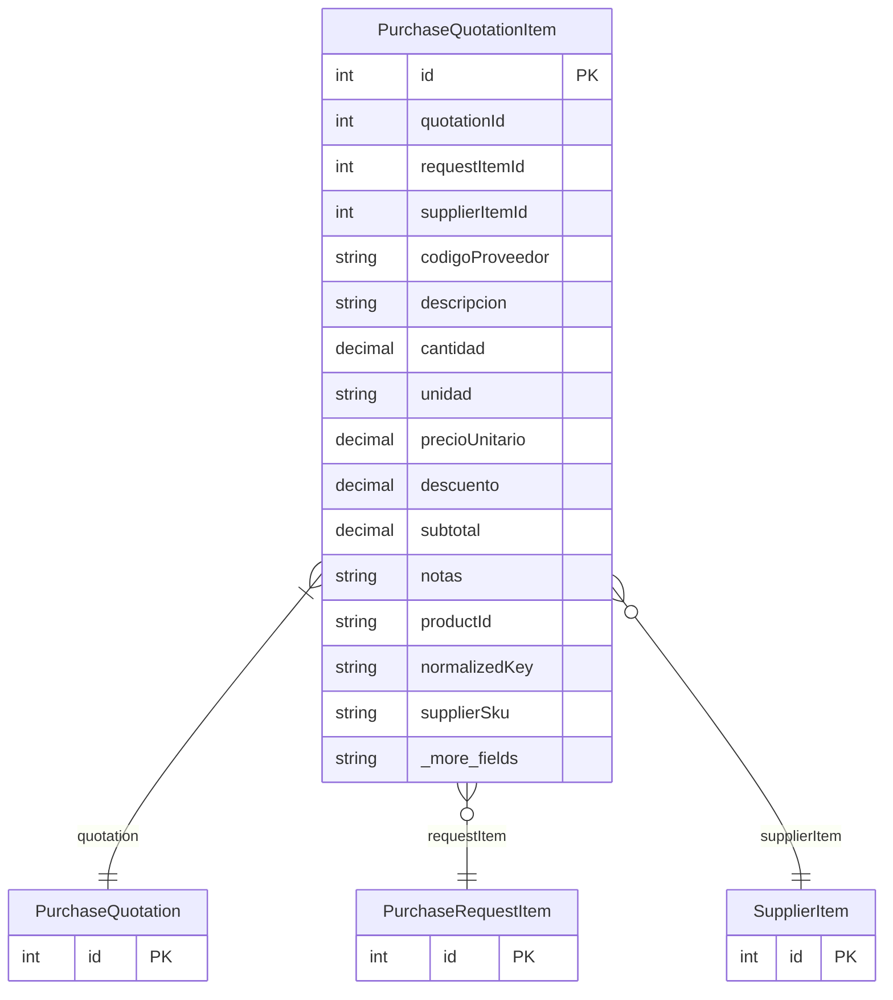

# PurchaseQuotationItem

> Table name: `purchase_quotation_items`

**Schema location:** Lines 7860-7889

## Fields

| Field | Type | Required | Unique | Default | Notes |
|-------|------|----------|--------|---------|-------|
| `id` | `Int` | ✅ | 🔑 PK | `autoincrement(` |  |
| `quotationId` | `Int` | ✅ |  | `` |  |
| `requestItemId` | `Int?` | ❌ |  | `` | Link al item solicitado |
| `supplierItemId` | `Int?` | ❌ |  | `` | Item del catálogo del proveedor |
| `codigoProveedor` | `String?` | ❌ |  | `` | DB: VarChar(100). Código del producto según el proveedor |
| `descripcion` | `String` | ✅ |  | `` | DB: VarChar(500) |
| `cantidad` | `Decimal` | ✅ |  | `` | DB: Decimal(15, 4) |
| `unidad` | `String` | ✅ |  | `` | DB: VarChar(50) |
| `precioUnitario` | `Decimal` | ✅ |  | `` | DB: Decimal(15, 4) |
| `descuento` | `Decimal` | ✅ |  | `0` | DB: Decimal(5, 2). % |
| `subtotal` | `Decimal` | ✅ |  | `` | DB: Decimal(15, 2) |
| `notas` | `String?` | ❌ |  | `` |  |
| `productId` | `String?` | ❌ |  | `` | ID de producto interno (si existe) |
| `normalizedKey` | `String?` | ❌ |  | `` | DB: VarChar(200). Clave normalizada para matching |
| `supplierSku` | `String?` | ❌ |  | `` | DB: VarChar(100). SKU del proveedor |
| `isSubstitute` | `Boolean` | ✅ |  | `false` | Es un sustituto |
| `substituteFor` | `Int?` | ❌ |  | `` | requestItemId que sustituye |

## Relations

| Field | Type | Cardinality | FK Fields | References | On Delete |
|-------|------|-------------|-----------|------------|-----------|
| `quotation` | [PurchaseQuotation](./models/PurchaseQuotation.md) | Many-to-One | quotationId | id | Cascade |
| `requestItem` | [PurchaseRequestItem](./models/PurchaseRequestItem.md) | Many-to-One (optional) | requestItemId | id | - |
| `supplierItem` | [SupplierItem](./models/SupplierItem.md) | Many-to-One (optional) | supplierItemId | id | - |

## Referenced By

| Model | Field | Cardinality |
|-------|-------|-------------|
| [SupplierItem](./models/SupplierItem.md) | `purchaseQuotationItems` | Has many |
| [PurchaseRequestItem](./models/PurchaseRequestItem.md) | `quotationItems` | Has many |
| [PurchaseQuotation](./models/PurchaseQuotation.md) | `items` | Has many |

## Indexes

- `quotationId`
- `productId`
- `normalizedKey`

## Entity Diagram

