# PurchaseReceipt

> Table name: `PurchaseReceipt`

**Schema location:** Lines 4581-4713

## Fields

| Field | Type | Required | Unique | Default | Notes |
|-------|------|----------|--------|---------|-------|
| `id` | `Int` | ✅ | 🔑 PK | `autoincrement(` |  |
| `numeroSerie` | `String` | ✅ |  | `` | DB: VarChar(10) |
| `numeroFactura` | `String` | ✅ |  | `` | DB: VarChar(20) |
| `tipo` | `String` | ✅ |  | `` | DB: VarChar(50) |
| `proveedorId` | `Int` | ✅ |  | `` |  |
| `fechaEmision` | `DateTime` | ✅ |  | `` | DB: Date |
| `fechaVencimiento` | `DateTime?` | ❌ |  | `` | DB: Date |
| `fechaImputacion` | `DateTime` | ✅ |  | `` | DB: Date |
| `tipoPago` | `String` | ✅ |  | `` | DB: VarChar(20) |
| `metodoPago` | `String?` | ❌ |  | `` | DB: VarChar(50) |
| `neto` | `Decimal` | ✅ |  | `` | DB: Decimal(15, 2) |
| `iva21` | `Decimal` | ✅ |  | `0` | DB: Decimal(15, 2) |
| `noGravado` | `Decimal` | ✅ |  | `0` | DB: Decimal(15, 2) |
| `impInter` | `Decimal` | ✅ |  | `0` | DB: Decimal(15, 2) |
| `percepcionIVA` | `Decimal` | ✅ |  | `0` | DB: Decimal(15, 2) |
| `percepcionIIBB` | `Decimal` | ✅ |  | `0` | DB: Decimal(15, 2) |
| `otrosConceptos` | `Decimal` | ✅ |  | `0` | DB: Decimal(15, 2) |
| `iva105` | `Decimal` | ✅ |  | `0` | DB: Decimal(15, 2) |
| `iva27` | `Decimal` | ✅ |  | `0` | DB: Decimal(15, 2) |
| `exento` | `Decimal` | ✅ |  | `0` | DB: Decimal(15, 2) |
| `iibb` | `Decimal` | ✅ |  | `0` | DB: Decimal(15, 2) |
| `total` | `Decimal` | ✅ |  | `` | DB: Decimal(15, 2) |
| `tipoCuentaId` | `Int` | ✅ |  | `` |  |
| `estado` | `String` | ✅ |  | `"pendiente"` | DB: VarChar(20) |
| `observaciones` | `String?` | ❌ |  | `` |  |
| `pagoUrgente` | `Boolean` | ✅ |  | `false` |  |
| `cae` | `String?` | ❌ |  | `` | DB: VarChar(20). CAE/CAI para verificación AFIP |
| `fechaVtoCae` | `DateTime?` | ❌ |  | `` | DB: Date |
| `costCenterId` | `Int?` | ❌ |  | `` | Centro de costo / Proyecto |
| `projectId` | `Int?` | ❌ |  | `` |  |
| `companyId` | `Int` | ✅ |  | `` |  |
| `createdBy` | `Int` | ✅ |  | `` |  |
| `createdAt` | `DateTime` | ✅ |  | `now(` |  |
| `updatedAt` | `DateTime` | ✅ |  | `` |  |
| `proveedor` | `suppliers` | ✅ |  | `` |  |
| `ingresoConfirmado` | `Boolean` | ✅ |  | `false` | Control de ingreso de stock / Remito |
| `ingresoConfirmadoPor` | `Int?` | ❌ |  | `` |  |
| `ingresoConfirmadoAt` | `DateTime?` | ❌ |  | `` |  |
| `firmaIngreso` | `String?` | ❌ |  | `` | URL de imagen de firma (S3) |
| `remitoUrl` | `String?` | ❌ |  | `` | PDF/imagen del remito |
| `fotoIngresoUrl` | `String?` | ❌ |  | `` | Foto del material recibido |
| `pagoForzado` | `Boolean` | ✅ |  | `false` | Control de pago forzado (sin confirmación de ingreso) |
| `pagoForzadoPor` | `Int?` | ❌ |  | `` |  |
| `pagoForzadoAt` | `DateTime?` | ❌ |  | `` |  |
| `matchCheckedAt` | `DateTime?` | ❌ |  | `` |  |
| `matchBlockReason` | `String?` | ❌ |  | `` |  |
| `facturaValidada` | `Boolean` | ✅ |  | `false` | Validación de Factura (control humano: "está bien cargada") |
| `validadaPor` | `Int?` | ❌ |  | `` |  |
| `validadaAt` | `DateTime?` | ❌ |  | `` |  |
| `payApprovedBy` | `Int?` | ❌ |  | `` |  |
| `payApprovedAt` | `DateTime?` | ❌ |  | `` |  |
| `payRejectedReason` | `String?` | ❌ |  | `` |  |
| `prontoPagoDisponible` | `Boolean` | ✅ |  | `false` | Pronto Pago |
| `prontoPagoFechaLimite` | `DateTime?` | ❌ |  | `` |  |
| `prontoPagoPorcentaje` | `Decimal?` | ❌ |  | `` | DB: Decimal(5, 2) |
| `prontoPagoMonto` | `Decimal?` | ❌ |  | `` | DB: Decimal(15, 2) |
| `prontoPagoAplicado` | `Boolean` | ✅ |  | `false` |  |
| `prontoPagoAplicadoAt` | `DateTime?` | ❌ |  | `` |  |
| `requiereRevisionDuplicado` | `Boolean` | ✅ |  | `false` | Control de duplicados |
| `motivoBloqueo` | `String?` | ❌ |  | `` |  |

## Relations

| Field | Type | Cardinality | FK Fields | References | On Delete |
|-------|------|-------------|-----------|------------|-----------|
| `docType` | [DocType](./models/DocType.md) | Many-to-One (optional) | - | - | - |
| `priceHistory` | [PriceHistory](./models/PriceHistory.md) | One-to-Many | - | - | - |
| `company` | [Company](./models/Company.md) | Many-to-One | companyId | id | Cascade |
| `createdByUser` | [User](./models/User.md) | Many-to-One | createdBy | id | - |
| `tipoCuenta` | [PurchaseAccount](./models/PurchaseAccount.md) | Many-to-One | tipoCuentaId | id | - |
| `items` | [PurchaseReceiptItem](./models/PurchaseReceiptItem.md) | One-to-Many | - | - | - |
| `PaymentOrderReceipt` | [PaymentOrderReceipt](./models/PaymentOrderReceipt.md) | One-to-Many | - | - | - |
| `goodsReceipts` | [GoodsReceipt](./models/GoodsReceipt.md) | One-to-Many | - | - | - |
| `matchResults` | [MatchResult](./models/MatchResult.md) | One-to-Many | - | - | - |
| `paymentRequestReceipts` | [PaymentRequestReceipt](./models/PaymentRequestReceipt.md) | One-to-Many | - | - | - |
| `creditDebitNotes` | [CreditDebitNote](./models/CreditDebitNote.md) | One-to-Many | - | - | - |
| `creditNoteRequests` | [CreditNoteRequest](./models/CreditNoteRequest.md) | One-to-Many | - | - | - |
| `costCenter` | [CostCenter](./models/CostCenter.md) | Many-to-One (optional) | costCenterId | id | - |
| `project` | [Project](./models/Project.md) | Many-to-One (optional) | projectId | id | - |
| `accountMovements` | [SupplierAccountMovement](./models/SupplierAccountMovement.md) | One-to-Many | - | - | - |
| `creditAllocations` | [SupplierCreditAllocation](./models/SupplierCreditAllocation.md) | One-to-Many | - | - | - |
| `purchaseReturnsFromFactura` | [PurchaseReturn](./models/PurchaseReturn.md) | One-to-Many | - | - | - |
| `matchStatus` | [FacturaMatchStatus](./models/FacturaMatchStatus.md) | Many-to-One | - | - | - |
| `payApprovalStatus` | [PayApprovalStatus](./models/PayApprovalStatus.md) | Many-to-One | - | - | - |
| `ingresoConfirmadoByUser` | [User](./models/User.md) | Many-to-One (optional) | ingresoConfirmadoPor | id | - |
| `pagoForzadoByUser` | [User](./models/User.md) | Many-to-One (optional) | pagoForzadoPor | id | - |
| `validadoByUser` | [User](./models/User.md) | Many-to-One (optional) | validadaPor | id | - |
| `payApprovedByUser` | [User](./models/User.md) | Many-to-One (optional) | payApprovedBy | id | - |
| `grniAccruals` | [GRNIAccrual](./models/GRNIAccrual.md) | One-to-Many | - | - | - |

## Referenced By

| Model | Field | Cardinality |
|-------|-------|-------------|
| [Company](./models/Company.md) | `purchaseReceipts` | Has many |
| [User](./models/User.md) | `createdPurchaseReceipts` | Has many |
| [User](./models/User.md) | `receiptsIngresoConfirmado` | Has many |
| [User](./models/User.md) | `receiptsPagoForzado` | Has many |
| [User](./models/User.md) | `receiptsValidado` | Has many |
| [User](./models/User.md) | `receiptsPayApproved` | Has many |
| [suppliers](./models/suppliers.md) | `purchaseReceipts` | Has many |
| [SupplierAccountMovement](./models/SupplierAccountMovement.md) | `factura` | Has one |
| [PurchaseAccount](./models/PurchaseAccount.md) | `comprobantes` | Has many |
| [PurchaseReceiptItem](./models/PurchaseReceiptItem.md) | `comprobante` | Has one |
| [PriceHistory](./models/PriceHistory.md) | `comprobante` | Has one |
| [PaymentOrderReceipt](./models/PaymentOrderReceipt.md) | `receipt` | Has one |
| [SupplierCreditAllocation](./models/SupplierCreditAllocation.md) | `receipt` | Has one |
| [GoodsReceipt](./models/GoodsReceipt.md) | `factura` | Has one |
| [GRNIAccrual](./models/GRNIAccrual.md) | `factura` | Has one |
| [CreditDebitNote](./models/CreditDebitNote.md) | `factura` | Has one |
| [CreditNoteRequest](./models/CreditNoteRequest.md) | `factura` | Has one |
| [MatchResult](./models/MatchResult.md) | `factura` | Has one |
| [CostCenter](./models/CostCenter.md) | `receipts` | Has many |
| [Project](./models/Project.md) | `receipts` | Has many |
| [PaymentRequestReceipt](./models/PaymentRequestReceipt.md) | `receipt` | Has one |
| [PurchaseReturn](./models/PurchaseReturn.md) | `factura` | Has one |

## Indexes

- `companyId`
- `proveedorId`
- `tipoCuentaId`
- `fechaEmision`
- `fechaImputacion`
- `estado`
- `companyId, estado, pagoUrgente`
- `companyId, proveedorId, estado`
- `cae`
- `costCenterId`
- `projectId`
- `docType`
- `companyId, docType`
- `ingresoConfirmado`
- `companyId, ingresoConfirmado`
- `matchStatus`
- `companyId, matchStatus`
- `payApprovalStatus`
- `companyId, payApprovalStatus`
- `prontoPagoDisponible, prontoPagoFechaLimite`
- `companyId, proveedorId, fechaEmision`

## Entity Diagram

```mermaid
erDiagram
    PurchaseReceipt {
        int id PK
        string numeroSerie
        string numeroFactura
        string tipo
        int proveedorId
        datetime fechaEmision
        datetime fechaVencimiento
        datetime fechaImputacion
        string tipoPago
        string metodoPago
        decimal neto
        decimal iva21
        decimal noGravado
        decimal impInter
        decimal percepcionIVA
        string _more_fields
    }
    PriceHistory {
        int id PK
    }
    Company {
        int id PK
    }
    User {
        int id PK
    }
    PurchaseAccount {
        int id PK
    }
    PurchaseReceiptItem {
        int id PK
    }
    PaymentOrderReceipt {
        int id PK
    }
    GoodsReceipt {
        int id PK
    }
    MatchResult {
        int id PK
    }
    PaymentRequestReceipt {
        int id PK
    }
    CreditDebitNote {
        int id PK
    }
    CreditNoteRequest {
        int id PK
    }
    CostCenter {
        int id PK
    }
    Project {
        int id PK
    }
    SupplierAccountMovement {
        int id PK
    }
    SupplierCreditAllocation {
        int id PK
    }
    PurchaseReturn {
        int id PK
    }
    GRNIAccrual {
        int id PK
    }
    suppliers {
        int id PK
    }
    PurchaseReceipt }o--|| DocType : "docType"
    PurchaseReceipt ||--o{ PriceHistory : "priceHistory"
    PurchaseReceipt }|--|| Company : "company"
    PurchaseReceipt }|--|| User : "createdByUser"
    PurchaseReceipt }|--|| PurchaseAccount : "tipoCuenta"
    PurchaseReceipt ||--o{ PurchaseReceiptItem : "items"
    PurchaseReceipt ||--o{ PaymentOrderReceipt : "PaymentOrderReceipt"
    PurchaseReceipt ||--o{ GoodsReceipt : "goodsReceipts"
    PurchaseReceipt ||--o{ MatchResult : "matchResults"
    PurchaseReceipt ||--o{ PaymentRequestReceipt : "paymentRequestReceipts"
    PurchaseReceipt ||--o{ CreditDebitNote : "creditDebitNotes"
    PurchaseReceipt ||--o{ CreditNoteRequest : "creditNoteRequests"
    PurchaseReceipt }o--|| CostCenter : "costCenter"
    PurchaseReceipt }o--|| Project : "project"
    PurchaseReceipt ||--o{ SupplierAccountMovement : "accountMovements"
    PurchaseReceipt ||--o{ SupplierCreditAllocation : "creditAllocations"
    PurchaseReceipt ||--o{ PurchaseReturn : "purchaseReturnsFromFactura"
    PurchaseReceipt }|--|| FacturaMatchStatus : "matchStatus"
    PurchaseReceipt }|--|| PayApprovalStatus : "payApprovalStatus"
    PurchaseReceipt }o--|| User : "ingresoConfirmadoByUser"
    PurchaseReceipt }o--|| User : "pagoForzadoByUser"
    PurchaseReceipt }o--|| User : "validadoByUser"
    PurchaseReceipt }o--|| User : "payApprovedByUser"
    PurchaseReceipt ||--o{ GRNIAccrual : "grniAccruals"
```

