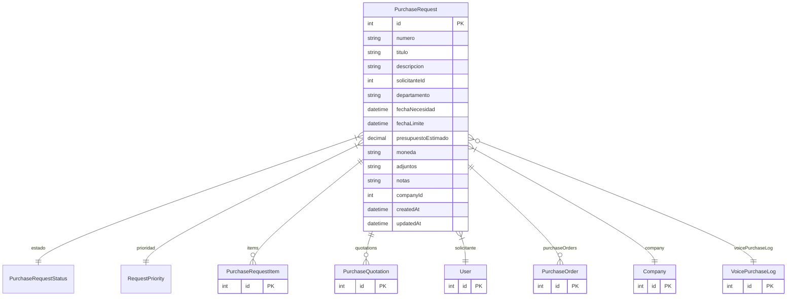

# PurchaseRequest

> Table name: `purchase_requests`

**Schema location:** Lines 7701-7745

## Fields

| Field | Type | Required | Unique | Default | Notes |
|-------|------|----------|--------|---------|-------|
| `id` | `Int` | ✅ | 🔑 PK | `autoincrement(` |  |
| `numero` | `String` | ✅ |  | `` | DB: VarChar(50). REQ-2026-00001 |
| `titulo` | `String` | ✅ |  | `` | DB: VarChar(200) |
| `descripcion` | `String?` | ❌ |  | `` |  |
| `solicitanteId` | `Int` | ✅ |  | `` | Solicitante |
| `departamento` | `String?` | ❌ |  | `` | DB: VarChar(100) |
| `fechaNecesidad` | `DateTime?` | ❌ |  | `` | DB: Date. Fechas |
| `fechaLimite` | `DateTime?` | ❌ |  | `` | DB: Date |
| `presupuestoEstimado` | `Decimal?` | ❌ |  | `` | DB: Decimal(15, 2). Presupuesto estimado |
| `moneda` | `String` | ✅ |  | `"ARS"` | DB: VarChar(10) |
| `adjuntos` | `String[]` | ✅ |  | `` | URLs a archivos |
| `notas` | `String?` | ❌ |  | `` |  |
| `companyId` | `Int` | ✅ |  | `` | Multi-tenant |
| `createdAt` | `DateTime` | ✅ |  | `now(` |  |
| `updatedAt` | `DateTime` | ✅ |  | `` |  |

## Relations

| Field | Type | Cardinality | FK Fields | References | On Delete |
|-------|------|-------------|-----------|------------|-----------|
| `estado` | [PurchaseRequestStatus](./models/PurchaseRequestStatus.md) | Many-to-One | - | - | - |
| `prioridad` | [RequestPriority](./models/RequestPriority.md) | Many-to-One | - | - | - |
| `items` | [PurchaseRequestItem](./models/PurchaseRequestItem.md) | One-to-Many | - | - | - |
| `quotations` | [PurchaseQuotation](./models/PurchaseQuotation.md) | One-to-Many | - | - | - |
| `solicitante` | [User](./models/User.md) | Many-to-One | solicitanteId | id | - |
| `purchaseOrders` | [PurchaseOrder](./models/PurchaseOrder.md) | One-to-Many | - | - | - |
| `company` | [Company](./models/Company.md) | Many-to-One | companyId | id | Cascade |
| `voicePurchaseLog` | [VoicePurchaseLog](./models/VoicePurchaseLog.md) | Many-to-One (optional) | - | - | - |

## Referenced By

| Model | Field | Cardinality |
|-------|-------|-------------|
| [Company](./models/Company.md) | `purchaseRequests` | Has many |
| [User](./models/User.md) | `purchaseRequestsSolicitante` | Has many |
| [PurchaseOrder](./models/PurchaseOrder.md) | `purchaseRequest` | Has one |
| [PurchaseRequestItem](./models/PurchaseRequestItem.md) | `request` | Has one |
| [PurchaseQuotation](./models/PurchaseQuotation.md) | `request` | Has one |
| [VoicePurchaseLog](./models/VoicePurchaseLog.md) | `purchaseRequest` | Has one |

## Indexes

- `companyId`
- `estado`
- `solicitanteId`
- `prioridad`
- `createdAt`
- `fechaNecesidad`
- `companyId, estado, createdAt`
- `companyId, prioridad, estado`

## Unique Constraints

- `companyId, numero`

## Entity Diagram

