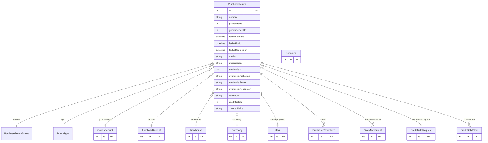

# PurchaseReturn

> Table name: `purchase_returns`

**Schema location:** Lines 7456-7515

## Fields

| Field | Type | Required | Unique | Default | Notes |
|-------|------|----------|--------|---------|-------|
| `id` | `Int` | ✅ | 🔑 PK | `autoincrement(` |  |
| `numero` | `String` | ✅ |  | `` | DB: VarChar(50) |
| `proveedorId` | `Int` | ✅ |  | `` |  |
| `goodsReceiptId` | `Int?` | ❌ |  | `` | Recepción original |
| `fechaSolicitud` | `DateTime` | ✅ |  | `` | DB: Date |
| `fechaEnvio` | `DateTime?` | ❌ |  | `` | DB: Date |
| `fechaResolucion` | `DateTime?` | ❌ |  | `` | DB: Date |
| `motivo` | `String` | ✅ |  | `` |  |
| `descripcion` | `String?` | ❌ |  | `` |  |
| `evidencias` | `Json?` | ❌ |  | `` | Array de URLs de fotos/documentos (legacy) |
| `evidenciaProblema` | `String?` | ❌ |  | `` | Foto/doc del problema detectado |
| `evidenciaEnvio` | `String?` | ❌ |  | `` | Foto del remito de salida / transportista |
| `evidenciaRecepcion` | `String?` | ❌ |  | `` | Confirmación del proveedor |
| `resolucion` | `String?` | ❌ |  | `` | Resolución |
| `creditNoteId` | `Int?` | ❌ |  | `` | Nota de crédito asociada |
| `facturaId` | `Int?` | ❌ |  | `` | Factura origen (cuando la devolución se crea desde cuenta corriente) |
| `creditNoteRequestId` | `Int?` | ❌ |  | `` | Vinculación a solicitud de NCA |
| `carrier` | `String?` | ❌ |  | `` | Transportista |
| `trackingNumber` | `String?` | ❌ |  | `` | Número de seguimiento |
| `warehouseId` | `Int?` | ❌ |  | `` | Depósito origen (para validaciones) |
| `stockMovementCreated` | `Boolean` | ✅ |  | `false` | Control de idempotencia |
| `notas` | `String?` | ❌ |  | `` | Tracking |
| `companyId` | `Int` | ✅ |  | `` |  |
| `docType` | `String?` | ❌ |  | `"T1"` | DB: VarChar(10). Tipo de documento: T1 = AFIP standard, T2 = Extendido/interno |
| `createdBy` | `Int` | ✅ |  | `` |  |
| `createdAt` | `DateTime` | ✅ |  | `now(` |  |
| `updatedAt` | `DateTime` | ✅ |  | `` |  |
| `proveedor` | `suppliers` | ✅ |  | `` |  |

## Relations

| Field | Type | Cardinality | FK Fields | References | On Delete |
|-------|------|-------------|-----------|------------|-----------|
| `estado` | [PurchaseReturnStatus](./models/PurchaseReturnStatus.md) | Many-to-One | - | - | - |
| `tipo` | [ReturnType](./models/ReturnType.md) | Many-to-One | - | - | - |
| `goodsReceipt` | [GoodsReceipt](./models/GoodsReceipt.md) | Many-to-One (optional) | goodsReceiptId | id | - |
| `factura` | [PurchaseReceipt](./models/PurchaseReceipt.md) | Many-to-One (optional) | facturaId | id | - |
| `warehouse` | [Warehouse](./models/Warehouse.md) | Many-to-One (optional) | warehouseId | id | - |
| `company` | [Company](./models/Company.md) | Many-to-One | companyId | id | Cascade |
| `createdByUser` | [User](./models/User.md) | Many-to-One | createdBy | id | - |
| `items` | [PurchaseReturnItem](./models/PurchaseReturnItem.md) | One-to-Many | - | - | - |
| `stockMovements` | [StockMovement](./models/StockMovement.md) | One-to-Many | - | - | - |
| `creditNoteRequest` | [CreditNoteRequest](./models/CreditNoteRequest.md) | Many-to-One (optional) | creditNoteRequestId | id | - |
| `creditNotes` | [CreditDebitNote](./models/CreditDebitNote.md) | One-to-Many | - | - | - |

## Referenced By

| Model | Field | Cardinality |
|-------|-------|-------------|
| [Company](./models/Company.md) | `purchaseReturns` | Has many |
| [User](./models/User.md) | `purchaseReturnsCreated` | Has many |
| [suppliers](./models/suppliers.md) | `purchaseReturns` | Has many |
| [PurchaseReceipt](./models/PurchaseReceipt.md) | `purchaseReturnsFromFactura` | Has many |
| [Warehouse](./models/Warehouse.md) | `purchaseReturns` | Has many |
| [StockMovement](./models/StockMovement.md) | `purchaseReturn` | Has one |
| [GoodsReceipt](./models/GoodsReceipt.md) | `purchaseReturns` | Has many |
| [CreditDebitNote](./models/CreditDebitNote.md) | `purchaseReturn` | Has one |
| [CreditNoteRequest](./models/CreditNoteRequest.md) | `purchaseReturns` | Has many |
| [PurchaseReturnItem](./models/PurchaseReturnItem.md) | `return` | Has one |

## Indexes

- `companyId`
- `proveedorId`
- `estado`
- `creditNoteRequestId`
- `warehouseId`
- `facturaId`

## Unique Constraints

- `companyId, numero`

## Entity Diagram

