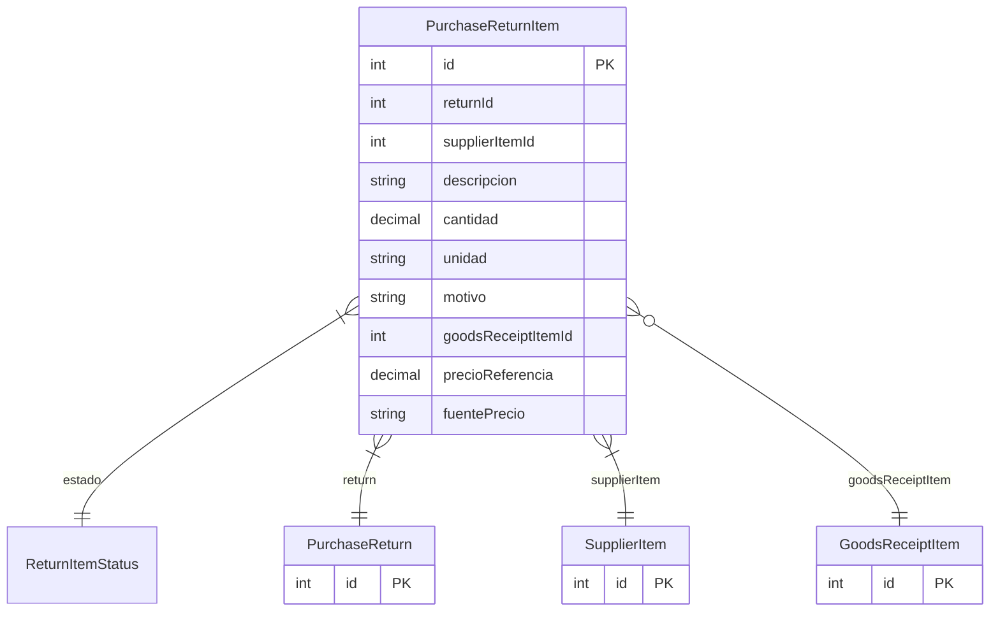

# PurchaseReturnItem

> Table name: `purchase_return_items`

**Schema location:** Lines 7517-7540

## Fields

| Field | Type | Required | Unique | Default | Notes |
|-------|------|----------|--------|---------|-------|
| `id` | `Int` | ✅ | 🔑 PK | `autoincrement(` |  |
| `returnId` | `Int` | ✅ |  | `` |  |
| `supplierItemId` | `Int` | ✅ |  | `` |  |
| `descripcion` | `String` | ✅ |  | `` | DB: VarChar(255) |
| `cantidad` | `Decimal` | ✅ |  | `` | DB: Decimal(15, 4) |
| `unidad` | `String` | ✅ |  | `` | DB: VarChar(50) |
| `motivo` | `String?` | ❌ |  | `` |  |
| `goodsReceiptItemId` | `Int?` | ❌ |  | `` | Trazabilidad: de dónde viene el item |
| `precioReferencia` | `Decimal?` | ❌ |  | `` | DB: Decimal(15, 2). Precio de referencia (fuente de verdad para validaciones NCA) |
| `fuentePrecio` | `String?` | ❌ |  | `` | 'GR_ITEM' | 'FACTURA' | 'MANUAL' |

## Relations

| Field | Type | Cardinality | FK Fields | References | On Delete |
|-------|------|-------------|-----------|------------|-----------|
| `estado` | [ReturnItemStatus](./models/ReturnItemStatus.md) | Many-to-One | - | - | - |
| `return` | [PurchaseReturn](./models/PurchaseReturn.md) | Many-to-One | returnId | id | Cascade |
| `supplierItem` | [SupplierItem](./models/SupplierItem.md) | Many-to-One | supplierItemId | id | - |
| `goodsReceiptItem` | [GoodsReceiptItem](./models/GoodsReceiptItem.md) | Many-to-One (optional) | goodsReceiptItemId | id | - |

## Referenced By

| Model | Field | Cardinality |
|-------|-------|-------------|
| [SupplierItem](./models/SupplierItem.md) | `purchaseReturnItems` | Has many |
| [GoodsReceiptItem](./models/GoodsReceiptItem.md) | `returnItems` | Has many |
| [PurchaseReturn](./models/PurchaseReturn.md) | `items` | Has many |

## Indexes

- `returnId`
- `goodsReceiptItemId`

## Unique Constraints

- `returnId, goodsReceiptItemId`

## Entity Diagram

