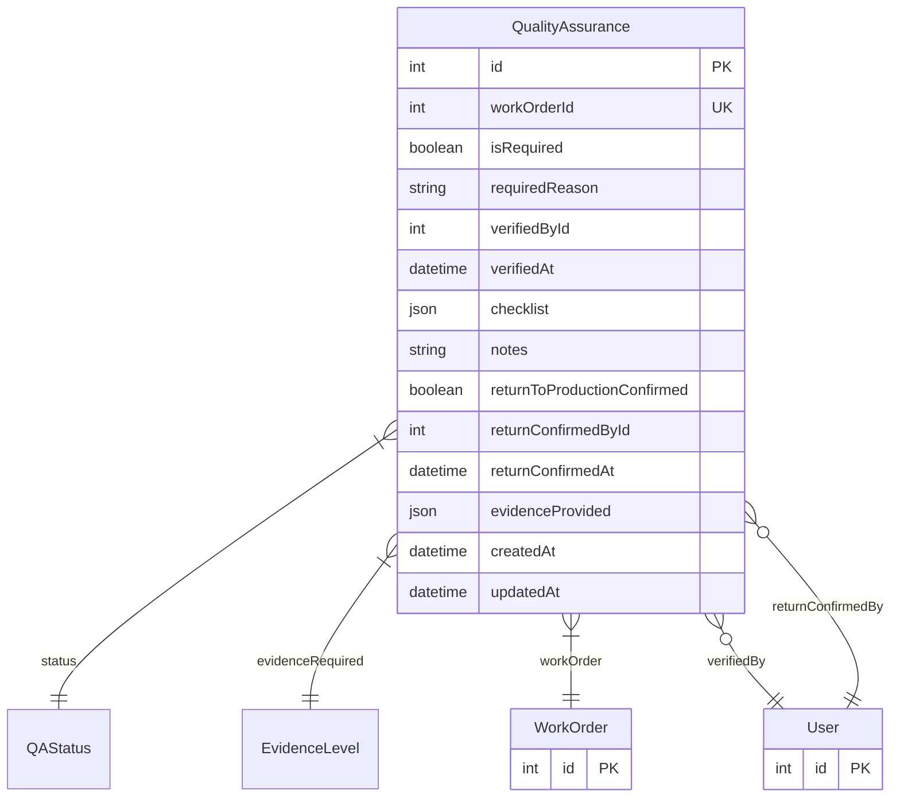

# QualityAssurance

> Table name: `quality_assurance`

**Schema location:** Lines 5633-5658

## Fields

| Field | Type | Required | Unique | Default | Notes |
|-------|------|----------|--------|---------|-------|
| `id` | `Int` | ✅ | 🔑 PK | `autoincrement(` |  |
| `workOrderId` | `Int` | ✅ | ✅ | `` |  |
| `isRequired` | `Boolean` | ✅ |  | `false` |  |
| `requiredReason` | `String?` | ❌ |  | `` | SAFETY | HIGH_PRIORITY | HIGH_CRITICALITY | HIGH_DOWNTIME | RECURRENCE |
| `verifiedById` | `Int?` | ❌ |  | `` |  |
| `verifiedAt` | `DateTime?` | ❌ |  | `` |  |
| `checklist` | `Json?` | ❌ |  | `` |  |
| `notes` | `String?` | ❌ |  | `` |  |
| `returnToProductionConfirmed` | `Boolean` | ✅ |  | `false` |  |
| `returnConfirmedById` | `Int?` | ❌ |  | `` |  |
| `returnConfirmedAt` | `DateTime?` | ❌ |  | `` |  |
| `evidenceProvided` | `Json?` | ❌ |  | `` |  |
| `createdAt` | `DateTime` | ✅ |  | `now(` |  |
| `updatedAt` | `DateTime` | ✅ |  | `` |  |

## Relations

| Field | Type | Cardinality | FK Fields | References | On Delete |
|-------|------|-------------|-----------|------------|-----------|
| `status` | [QAStatus](./models/QAStatus.md) | Many-to-One | - | - | - |
| `evidenceRequired` | [EvidenceLevel](./models/EvidenceLevel.md) | Many-to-One | - | - | - |
| `workOrder` | [WorkOrder](./models/WorkOrder.md) | Many-to-One | workOrderId | id | Cascade |
| `verifiedBy` | [User](./models/User.md) | Many-to-One (optional) | verifiedById | id | - |
| `returnConfirmedBy` | [User](./models/User.md) | Many-to-One (optional) | returnConfirmedById | id | - |

## Referenced By

| Model | Field | Cardinality |
|-------|-------|-------------|
| [User](./models/User.md) | `qaVerifications` | Has many |
| [User](./models/User.md) | `qaReturnConfirmed` | Has many |
| [WorkOrder](./models/WorkOrder.md) | `qualityAssurance` | Has one |

## Indexes

- `workOrderId`
- `status`

## Entity Diagram

