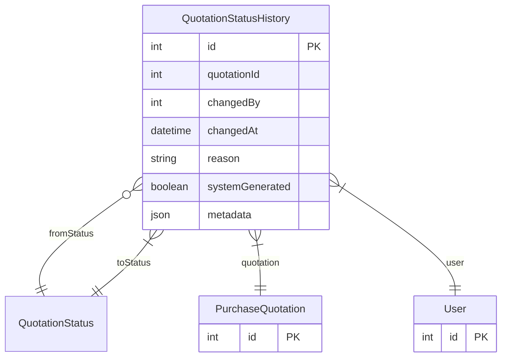

# QuotationStatusHistory

> Table name: `quotation_status_history`

**Schema location:** Lines 7902-7918

## Fields

| Field | Type | Required | Unique | Default | Notes |
|-------|------|----------|--------|---------|-------|
| `id` | `Int` | ✅ | 🔑 PK | `autoincrement(` |  |
| `quotationId` | `Int` | ✅ |  | `` |  |
| `changedBy` | `Int` | ✅ |  | `` |  |
| `changedAt` | `DateTime` | ✅ |  | `now(` |  |
| `reason` | `String?` | ❌ |  | `` | Motivo del cambio |
| `systemGenerated` | `Boolean` | ✅ |  | `false` | true si fue automático (ej: vencimiento) |
| `metadata` | `Json?` | ❌ |  | `` | Datos adicionales |

## Relations

| Field | Type | Cardinality | FK Fields | References | On Delete |
|-------|------|-------------|-----------|------------|-----------|
| `fromStatus` | [QuotationStatus](./models/QuotationStatus.md) | Many-to-One (optional) | - | - | - |
| `toStatus` | [QuotationStatus](./models/QuotationStatus.md) | Many-to-One | - | - | - |
| `quotation` | [PurchaseQuotation](./models/PurchaseQuotation.md) | Many-to-One | quotationId | id | Cascade |
| `user` | [User](./models/User.md) | Many-to-One | changedBy | id | - |

## Referenced By

| Model | Field | Cardinality |
|-------|-------|-------------|
| [User](./models/User.md) | `quotationStatusChanges` | Has many |
| [PurchaseQuotation](./models/PurchaseQuotation.md) | `statusHistory` | Has many |

## Indexes

- `quotationId, changedAt`

## Entity Diagram

