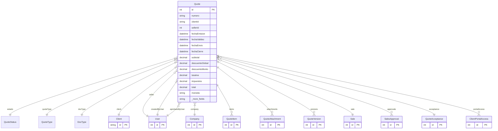

# Quote

> Table name: `quotes`

**Schema location:** Lines 8654-8762

## Fields

| Field | Type | Required | Unique | Default | Notes |
|-------|------|----------|--------|---------|-------|
| `id` | `Int` | ✅ | 🔑 PK | `autoincrement(` |  |
| `numero` | `String` | ✅ |  | `` | DB: VarChar(50) |
| `clientId` | `String` | ✅ |  | `` |  |
| `sellerId` | `Int?` | ❌ |  | `` |  |
| `fechaEmision` | `DateTime` | ✅ |  | `` | DB: Date. Fechas |
| `fechaValidez` | `DateTime` | ✅ |  | `` | DB: Date |
| `fechaEnvio` | `DateTime?` | ❌ |  | `` |  |
| `fechaCierre` | `DateTime?` | ❌ |  | `` |  |
| `subtotal` | `Decimal` | ✅ |  | `` | DB: Decimal(15, 2). Montos |
| `descuentoGlobal` | `Decimal` | ✅ |  | `0` | DB: Decimal(5, 2) |
| `descuentoMonto` | `Decimal` | ✅ |  | `0` | DB: Decimal(15, 2) |
| `tasaIva` | `Decimal` | ✅ |  | `21` | DB: Decimal(5, 2) |
| `impuestos` | `Decimal` | ✅ |  | `0` | DB: Decimal(15, 2) |
| `total` | `Decimal` | ✅ |  | `` | DB: Decimal(15, 2) |
| `moneda` | `String` | ✅ |  | `"ARS"` | DB: VarChar(10) |
| `tipoCambio` | `Decimal?` | ❌ |  | `` | DB: Decimal(15, 4) |
| `condicionesPago` | `String?` | ❌ |  | `` | DB: VarChar(255). Condiciones |
| `diasPlazo` | `Int?` | ❌ |  | `` |  |
| `condicionesEntrega` | `String?` | ❌ |  | `` | DB: VarChar(255) |
| `tiempoEntrega` | `String?` | ❌ |  | `` | DB: VarChar(100) |
| `lugarEntrega` | `String?` | ❌ |  | `` |  |
| `titulo` | `String?` | ❌ |  | `` | DB: VarChar(255). Descripción y Notas |
| `descripcion` | `String?` | ❌ |  | `` |  |
| `notas` | `String?` | ❌ |  | `` |  |
| `notasInternas` | `String?` | ❌ |  | `` |  |
| `requiereAprobacion` | `Boolean` | ✅ |  | `false` | Aprobación |
| `aprobadoPor` | `Int?` | ❌ |  | `` |  |
| `aprobadoAt` | `DateTime?` | ❌ |  | `` |  |
| `motivoPerdida` | `String?` | ❌ |  | `` | Cierre |
| `competidorGanador` | `String?` | ❌ |  | `` |  |
| `precioCompetidor` | `Decimal?` | ❌ |  | `` | DB: Decimal(15, 2) |
| `convertidaAVentaId` | `Int?` | ❌ |  | `` | Conversión |
| `convertidaAt` | `DateTime?` | ❌ |  | `` |  |
| `isExpired` | `Boolean` | ✅ |  | `false` | Vencimiento |
| `version` | `Int` | ✅ |  | `1` | Versionado |
| `costoTotal` | `Decimal?` | ❌ |  | `` | DB: Decimal(15, 2). Costos y Rentabilidad (solo visible con permiso) |
| `margenBruto` | `Decimal?` | ❌ |  | `` | DB: Decimal(15, 2) |
| `margenPorcentaje` | `Decimal?` | ❌ |  | `` | DB: Decimal(5, 2) |
| `comisionPorcentaje` | `Decimal?` | ❌ |  | `` | DB: Decimal(5, 2). Comisión |
| `comisionMonto` | `Decimal?` | ❌ |  | `` | DB: Decimal(15, 2) |
| `companyId` | `Int` | ✅ |  | `` | Tracking |
| `createdBy` | `Int` | ✅ |  | `` |  |
| `createdAt` | `DateTime` | ✅ |  | `now(` |  |
| `updatedAt` | `DateTime` | ✅ |  | `` |  |

## Relations

| Field | Type | Cardinality | FK Fields | References | On Delete |
|-------|------|-------------|-----------|------------|-----------|
| `estado` | [QuoteStatus](./models/QuoteStatus.md) | Many-to-One | - | - | - |
| `quoteType` | [QuoteType](./models/QuoteType.md) | Many-to-One | - | - | - |
| `docType` | [DocType](./models/DocType.md) | Many-to-One | - | - | - |
| `client` | [Client](./models/Client.md) | Many-to-One | clientId | id | - |
| `seller` | [User](./models/User.md) | Many-to-One (optional) | sellerId | id | - |
| `company` | [Company](./models/Company.md) | Many-to-One | companyId | id | Cascade |
| `createdByUser` | [User](./models/User.md) | Many-to-One | createdBy | id | - |
| `aprobadoByUser` | [User](./models/User.md) | Many-to-One (optional) | aprobadoPor | id | - |
| `items` | [QuoteItem](./models/QuoteItem.md) | One-to-Many | - | - | - |
| `attachments` | [QuoteAttachment](./models/QuoteAttachment.md) | One-to-Many | - | - | - |
| `versions` | [QuoteVersion](./models/QuoteVersion.md) | One-to-Many | - | - | - |
| `sale` | [Sale](./models/Sale.md) | Many-to-One (optional) | - | - | - |
| `approvals` | [SalesApproval](./models/SalesApproval.md) | One-to-Many | - | - | - |
| `acceptance` | [QuoteAcceptance](./models/QuoteAcceptance.md) | Many-to-One (optional) | - | - | - |
| `portalAccess` | [ClientPortalAccess](./models/ClientPortalAccess.md) | One-to-Many | - | - | - |

## Referenced By

| Model | Field | Cardinality |
|-------|-------|-------------|
| [Company](./models/Company.md) | `quotes` | Has many |
| [User](./models/User.md) | `quotesAsSeller` | Has many |
| [User](./models/User.md) | `quotesCreated` | Has many |
| [User](./models/User.md) | `quotesApproved` | Has many |
| [Client](./models/Client.md) | `quotes` | Has many |
| [QuoteItem](./models/QuoteItem.md) | `quote` | Has one |
| [QuoteAttachment](./models/QuoteAttachment.md) | `quote` | Has one |
| [QuoteVersion](./models/QuoteVersion.md) | `quote` | Has one |
| [ClientPortalAccess](./models/ClientPortalAccess.md) | `quote` | Has one |
| [QuoteAcceptance](./models/QuoteAcceptance.md) | `quote` | Has one |
| [Sale](./models/Sale.md) | `quote` | Has one |
| [SalesApproval](./models/SalesApproval.md) | `quote` | Has one |

## Indexes

- `companyId`
- `clientId`
- `sellerId`
- `estado`
- `fechaEmision`
- `fechaValidez`
- `docType`
- `companyId, docType`
- `companyId, docType, fechaEmision`
- `quoteType`
- `companyId, quoteType`
- `companyId, estado, createdAt`
- `companyId, fechaValidez`
- `companyId, clientId, createdAt`
- `companyId, sellerId, createdAt`
- `companyId, isExpired`

## Unique Constraints

- `companyId, numero`

## Entity Diagram

