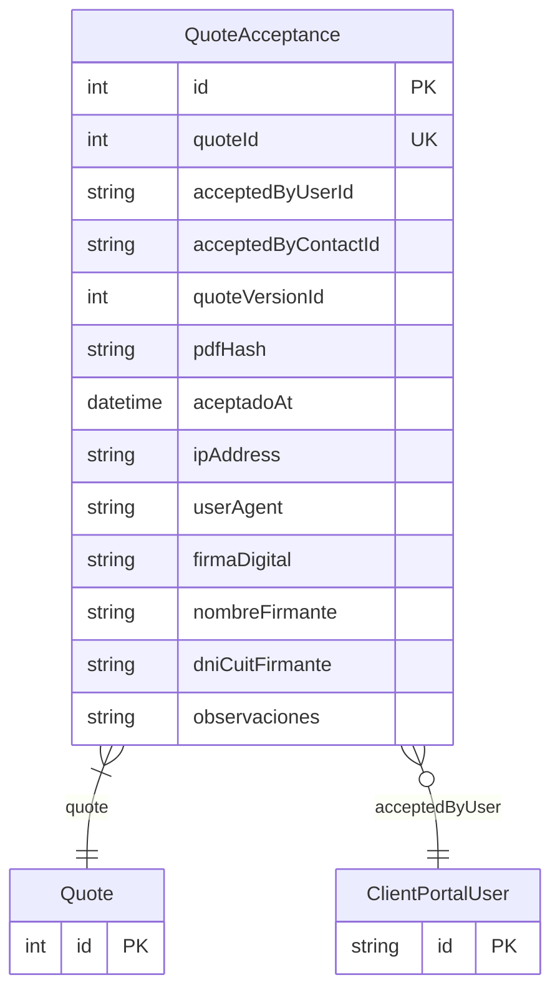

# QuoteAcceptance

> Table name: `quote_acceptances`

**Schema location:** Lines 9129-9155

## Fields

| Field | Type | Required | Unique | Default | Notes |
|-------|------|----------|--------|---------|-------|
| `id` | `Int` | ✅ | 🔑 PK | `autoincrement(` |  |
| `quoteId` | `Int` | ✅ | ✅ | `` |  |
| `acceptedByUserId` | `String?` | ❌ |  | `` | Quién aceptó (Portal) |
| `acceptedByContactId` | `String?` | ❌ |  | `` |  |
| `quoteVersionId` | `Int?` | ❌ |  | `` | Qué versión aceptó (inmutable) |
| `pdfHash` | `String?` | ❌ |  | `` | DB: VarChar(64) |
| `aceptadoAt` | `DateTime` | ✅ |  | `now(` | Datos de aceptación |
| `ipAddress` | `String?` | ❌ |  | `` | DB: VarChar(50) |
| `userAgent` | `String?` | ❌ |  | `` |  |
| `firmaDigital` | `String?` | ❌ |  | `` |  |
| `nombreFirmante` | `String?` | ❌ |  | `` | DB: VarChar(255) |
| `dniCuitFirmante` | `String?` | ❌ |  | `` | DB: VarChar(20) |
| `observaciones` | `String?` | ❌ |  | `` |  |

## Relations

| Field | Type | Cardinality | FK Fields | References | On Delete |
|-------|------|-------------|-----------|------------|-----------|
| `quote` | [Quote](./models/Quote.md) | Many-to-One | quoteId | id | Cascade |
| `acceptedByUser` | [ClientPortalUser](./models/ClientPortalUser.md) | Many-to-One (optional) | acceptedByUserId | id | - |

## Referenced By

| Model | Field | Cardinality |
|-------|-------|-------------|
| [Quote](./models/Quote.md) | `acceptance` | Has one |
| [ClientPortalUser](./models/ClientPortalUser.md) | `acceptedQuotes` | Has many |

## Entity Diagram

