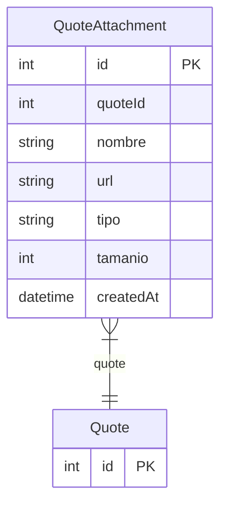

# QuoteAttachment

> Table name: `quote_attachments`

**Schema location:** Lines 8788-8801

## Fields

| Field | Type | Required | Unique | Default | Notes |
|-------|------|----------|--------|---------|-------|
| `id` | `Int` | ✅ | 🔑 PK | `autoincrement(` |  |
| `quoteId` | `Int` | ✅ |  | `` |  |
| `nombre` | `String` | ✅ |  | `` | DB: VarChar(255) |
| `url` | `String` | ✅ |  | `` |  |
| `tipo` | `String` | ✅ |  | `` | DB: VarChar(50) |
| `tamanio` | `Int?` | ❌ |  | `` |  |
| `createdAt` | `DateTime` | ✅ |  | `now(` |  |

## Relations

| Field | Type | Cardinality | FK Fields | References | On Delete |
|-------|------|-------------|-----------|------------|-----------|
| `quote` | [Quote](./models/Quote.md) | Many-to-One | quoteId | id | Cascade |

## Referenced By

| Model | Field | Cardinality |
|-------|-------|-------------|
| [Quote](./models/Quote.md) | `attachments` | Has many |

## Indexes

- `quoteId`

## Entity Diagram

