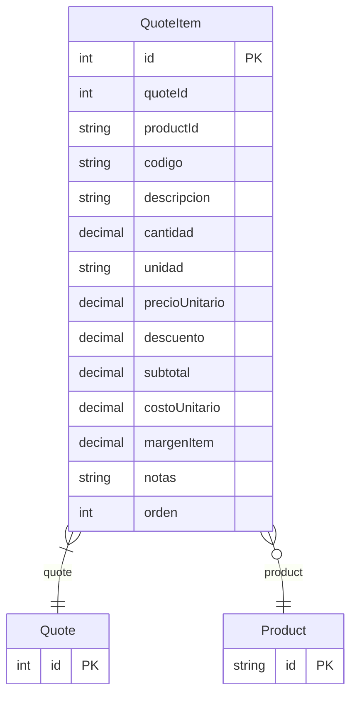

# QuoteItem

> Table name: `quote_items`

**Schema location:** Lines 8764-8786

## Fields

| Field | Type | Required | Unique | Default | Notes |
|-------|------|----------|--------|---------|-------|
| `id` | `Int` | ✅ | 🔑 PK | `autoincrement(` |  |
| `quoteId` | `Int` | ✅ |  | `` |  |
| `productId` | `String?` | ❌ |  | `` |  |
| `codigo` | `String?` | ❌ |  | `` | DB: VarChar(50) |
| `descripcion` | `String` | ✅ |  | `` | DB: VarChar(500) |
| `cantidad` | `Decimal` | ✅ |  | `` | DB: Decimal(15, 4) |
| `unidad` | `String` | ✅ |  | `` | DB: VarChar(50) |
| `precioUnitario` | `Decimal` | ✅ |  | `` | DB: Decimal(15, 2) |
| `descuento` | `Decimal` | ✅ |  | `0` | DB: Decimal(5, 2) |
| `subtotal` | `Decimal` | ✅ |  | `` | DB: Decimal(15, 2) |
| `costoUnitario` | `Decimal?` | ❌ |  | `` | DB: Decimal(15, 2) |
| `margenItem` | `Decimal?` | ❌ |  | `` | DB: Decimal(5, 2) |
| `notas` | `String?` | ❌ |  | `` |  |
| `orden` | `Int` | ✅ |  | `0` |  |

## Relations

| Field | Type | Cardinality | FK Fields | References | On Delete |
|-------|------|-------------|-----------|------------|-----------|
| `quote` | [Quote](./models/Quote.md) | Many-to-One | quoteId | id | Cascade |
| `product` | [Product](./models/Product.md) | Many-to-One (optional) | productId | id | - |

## Referenced By

| Model | Field | Cardinality |
|-------|-------|-------------|
| [Product](./models/Product.md) | `quoteItems` | Has many |
| [Quote](./models/Quote.md) | `items` | Has many |

## Indexes

- `quoteId`
- `productId`

## Entity Diagram

