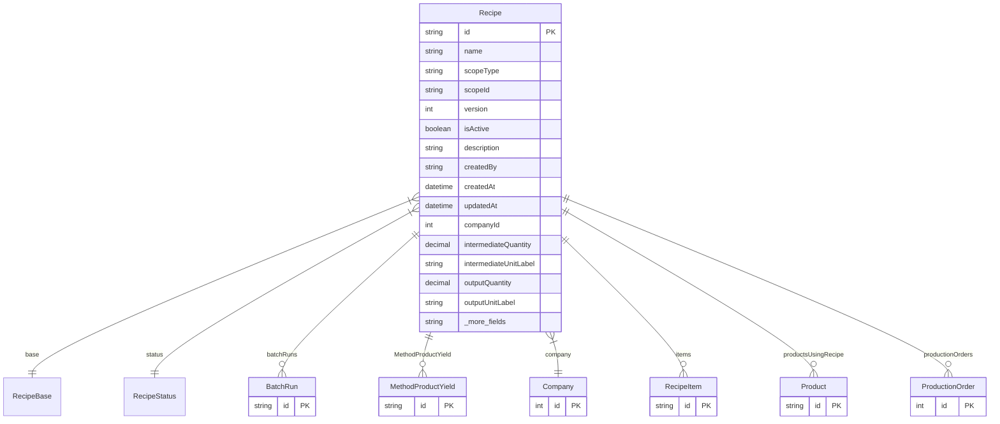

# Recipe

> Table name: `Recipe`

**Schema location:** Lines 2780-2813

## Fields

| Field | Type | Required | Unique | Default | Notes |
|-------|------|----------|--------|---------|-------|
| `id` | `String` | ✅ | 🔑 PK | `uuid(` |  |
| `name` | `String` | ✅ |  | `` |  |
| `scopeType` | `String` | ✅ |  | `` |  |
| `scopeId` | `String` | ✅ |  | `` |  |
| `version` | `Int` | ✅ |  | `` |  |
| `isActive` | `Boolean` | ✅ |  | `false` |  |
| `description` | `String?` | ❌ |  | `` |  |
| `createdBy` | `String?` | ❌ |  | `` |  |
| `createdAt` | `DateTime` | ✅ |  | `now(` |  |
| `updatedAt` | `DateTime` | ✅ |  | `` |  |
| `companyId` | `Int` | ✅ |  | `` |  |
| `intermediateQuantity` | `Decimal?` | ❌ |  | `` | DB: Decimal(12, 6) |
| `intermediateUnitLabel` | `String?` | ❌ |  | `` |  |
| `outputQuantity` | `Decimal?` | ❌ |  | `` | DB: Decimal(12, 6) |
| `outputUnitLabel` | `String?` | ❌ |  | `` |  |
| `baseQty` | `Decimal?` | ❌ |  | `` | DB: Decimal(12, 6) |
| `baseUnit` | `String?` | ❌ |  | `` |  |
| `validFrom` | `DateTime?` | ❌ |  | `` |  |
| `validTo` | `DateTime?` | ❌ |  | `` |  |

## Relations

| Field | Type | Cardinality | FK Fields | References | On Delete |
|-------|------|-------------|-----------|------------|-----------|
| `base` | [RecipeBase](./models/RecipeBase.md) | Many-to-One | - | - | - |
| `status` | [RecipeStatus](./models/RecipeStatus.md) | Many-to-One | - | - | - |
| `batchRuns` | [BatchRun](./models/BatchRun.md) | One-to-Many | - | - | - |
| `MethodProductYield` | [MethodProductYield](./models/MethodProductYield.md) | One-to-Many | - | - | - |
| `company` | [Company](./models/Company.md) | Many-to-One | companyId | id | Cascade |
| `items` | [RecipeItem](./models/RecipeItem.md) | One-to-Many | - | - | - |
| `productsUsingRecipe` | [Product](./models/Product.md) | One-to-Many | - | - | - |
| `productionOrders` | [ProductionOrder](./models/ProductionOrder.md) | One-to-Many | - | - | - |

## Referenced By

| Model | Field | Cardinality |
|-------|-------|-------------|
| [Company](./models/Company.md) | `recipes` | Has many |
| [Product](./models/Product.md) | `recipe` | Has one |
| [RecipeItem](./models/RecipeItem.md) | `recipe` | Has one |
| [BatchRun](./models/BatchRun.md) | `recipe` | Has one |
| [MethodProductYield](./models/MethodProductYield.md) | `Recipe` | Has one |
| [ProductionOrder](./models/ProductionOrder.md) | `recipe` | Has one |

## Unique Constraints

- `companyId, scopeType, scopeId, name`

## Entity Diagram

