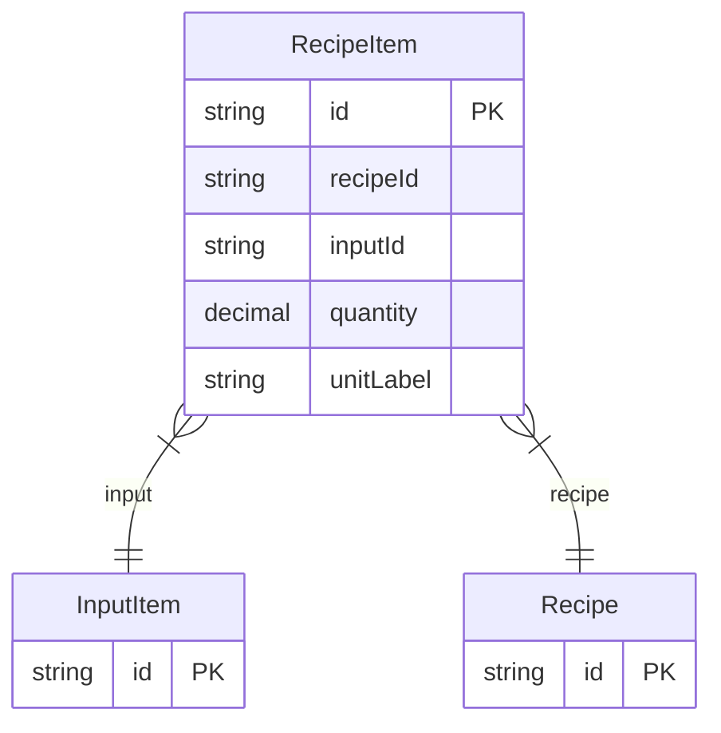

# RecipeItem

> Table name: `RecipeItem`

**Schema location:** Lines 2815-2826

## Fields

| Field | Type | Required | Unique | Default | Notes |
|-------|------|----------|--------|---------|-------|
| `id` | `String` | ✅ | 🔑 PK | `uuid(` |  |
| `recipeId` | `String` | ✅ |  | `` |  |
| `inputId` | `String` | ✅ |  | `` |  |
| `quantity` | `Decimal` | ✅ |  | `` | DB: Decimal(12, 6) |
| `unitLabel` | `String` | ✅ |  | `` |  |

## Relations

| Field | Type | Cardinality | FK Fields | References | On Delete |
|-------|------|-------------|-----------|------------|-----------|
| `input` | [InputItem](./models/InputItem.md) | Many-to-One | inputId | id | Cascade |
| `recipe` | [Recipe](./models/Recipe.md) | Many-to-One | recipeId | id | Cascade |

## Referenced By

| Model | Field | Cardinality |
|-------|-------|-------------|
| [InputItem](./models/InputItem.md) | `recipeItems` | Has many |
| [Recipe](./models/Recipe.md) | `items` | Has many |

## Unique Constraints

- `recipeId, inputId`

## Entity Diagram

