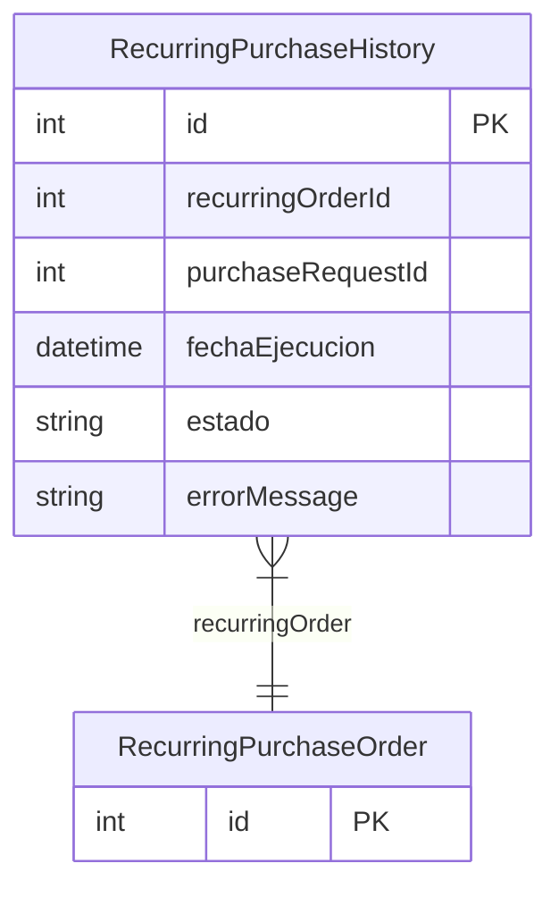

# RecurringPurchaseHistory

> Table name: `recurring_purchase_history`

**Schema location:** Lines 14348-14361

## Fields

| Field | Type | Required | Unique | Default | Notes |
|-------|------|----------|--------|---------|-------|
| `id` | `Int` | ✅ | 🔑 PK | `autoincrement(` |  |
| `recurringOrderId` | `Int` | ✅ |  | `` |  |
| `purchaseRequestId` | `Int?` | ❌ |  | `` | ID del pedido generado (puede ser null si falló) |
| `fechaEjecucion` | `DateTime` | ✅ |  | `now(` |  |
| `estado` | `String` | ✅ |  | `"SUCCESS"` | SUCCESS, FAILED |
| `errorMessage` | `String?` | ❌ |  | `` |  |

## Relations

| Field | Type | Cardinality | FK Fields | References | On Delete |
|-------|------|-------------|-----------|------------|-----------|
| `recurringOrder` | [RecurringPurchaseOrder](./models/RecurringPurchaseOrder.md) | Many-to-One | recurringOrderId | id | Cascade |

## Referenced By

| Model | Field | Cardinality |
|-------|-------|-------------|
| [RecurringPurchaseOrder](./models/RecurringPurchaseOrder.md) | `historial` | Has many |

## Indexes

- `recurringOrderId`
- `fechaEjecucion`

## Entity Diagram

