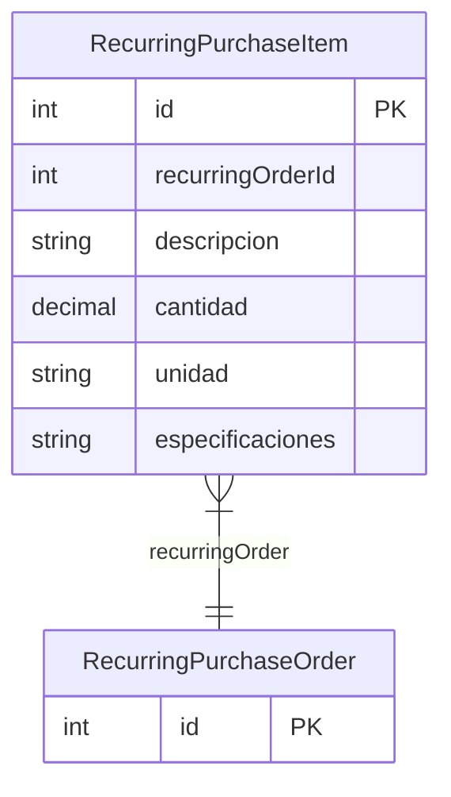

# RecurringPurchaseItem

> Table name: `recurring_purchase_items`

**Schema location:** Lines 14334-14346

## Fields

| Field | Type | Required | Unique | Default | Notes |
|-------|------|----------|--------|---------|-------|
| `id` | `Int` | ✅ | 🔑 PK | `autoincrement(` |  |
| `recurringOrderId` | `Int` | ✅ |  | `` |  |
| `descripcion` | `String` | ✅ |  | `` | DB: VarChar(500) |
| `cantidad` | `Decimal` | ✅ |  | `` | DB: Decimal(15, 4) |
| `unidad` | `String` | ✅ |  | `` | DB: VarChar(50) |
| `especificaciones` | `String?` | ❌ |  | `` |  |

## Relations

| Field | Type | Cardinality | FK Fields | References | On Delete |
|-------|------|-------------|-----------|------------|-----------|
| `recurringOrder` | [RecurringPurchaseOrder](./models/RecurringPurchaseOrder.md) | Many-to-One | recurringOrderId | id | Cascade |

## Referenced By

| Model | Field | Cardinality |
|-------|-------|-------------|
| [RecurringPurchaseOrder](./models/RecurringPurchaseOrder.md) | `items` | Has many |

## Indexes

- `recurringOrderId`

## Entity Diagram

