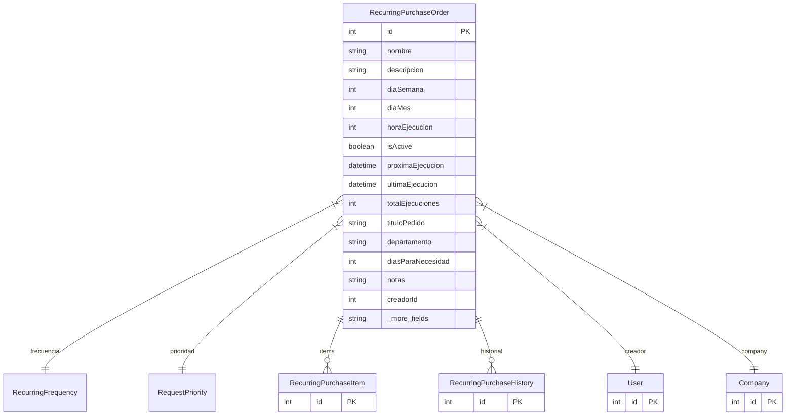

# RecurringPurchaseOrder

> Table name: `recurring_purchase_orders`

**Schema location:** Lines 14295-14332

## Fields

| Field | Type | Required | Unique | Default | Notes |
|-------|------|----------|--------|---------|-------|
| `id` | `Int` | ✅ | 🔑 PK | `autoincrement(` |  |
| `nombre` | `String` | ✅ |  | `` | DB: VarChar(200). "Insumos mensuales", "Limpieza semanal" |
| `descripcion` | `String?` | ❌ |  | `` |  |
| `diaSemana` | `Int?` | ❌ |  | `` | 0-6 para SEMANAL (0=Domingo) |
| `diaMes` | `Int?` | ❌ |  | `` | 1-31 para MENSUAL |
| `horaEjecucion` | `Int` | ✅ |  | `8` | Hora del día (0-23) |
| `isActive` | `Boolean` | ✅ |  | `true` | Control |
| `proximaEjecucion` | `DateTime?` | ❌ |  | `` | Próxima fecha de ejecución |
| `ultimaEjecucion` | `DateTime?` | ❌ |  | `` | Última ejecución |
| `totalEjecuciones` | `Int` | ✅ |  | `0` |  |
| `tituloPedido` | `String` | ✅ |  | `` | DB: VarChar(200). Título del pedido generado |
| `departamento` | `String?` | ❌ |  | `` | DB: VarChar(100) |
| `diasParaNecesidad` | `Int` | ✅ |  | `7` | Fecha necesidad = ejecución + N días |
| `notas` | `String?` | ❌ |  | `` |  |
| `creadorId` | `Int` | ✅ |  | `` | Usuario que lo creó y será el solicitante |
| `companyId` | `Int` | ✅ |  | `` | Multi-tenant |
| `createdAt` | `DateTime` | ✅ |  | `now(` |  |
| `updatedAt` | `DateTime` | ✅ |  | `` |  |

## Relations

| Field | Type | Cardinality | FK Fields | References | On Delete |
|-------|------|-------------|-----------|------------|-----------|
| `frecuencia` | [RecurringFrequency](./models/RecurringFrequency.md) | Many-to-One | - | - | - |
| `prioridad` | [RequestPriority](./models/RequestPriority.md) | Many-to-One | - | - | - |
| `items` | [RecurringPurchaseItem](./models/RecurringPurchaseItem.md) | One-to-Many | - | - | - |
| `historial` | [RecurringPurchaseHistory](./models/RecurringPurchaseHistory.md) | One-to-Many | - | - | - |
| `creador` | [User](./models/User.md) | Many-to-One | creadorId | id | - |
| `company` | [Company](./models/Company.md) | Many-to-One | companyId | id | Cascade |

## Referenced By

| Model | Field | Cardinality |
|-------|-------|-------------|
| [Company](./models/Company.md) | `recurringPurchaseOrders` | Has many |
| [User](./models/User.md) | `recurringPurchaseOrders` | Has many |
| [RecurringPurchaseItem](./models/RecurringPurchaseItem.md) | `recurringOrder` | Has one |
| [RecurringPurchaseHistory](./models/RecurringPurchaseHistory.md) | `recurringOrder` | Has one |

## Indexes

- `companyId`
- `isActive`
- `proximaEjecucion`

## Entity Diagram

