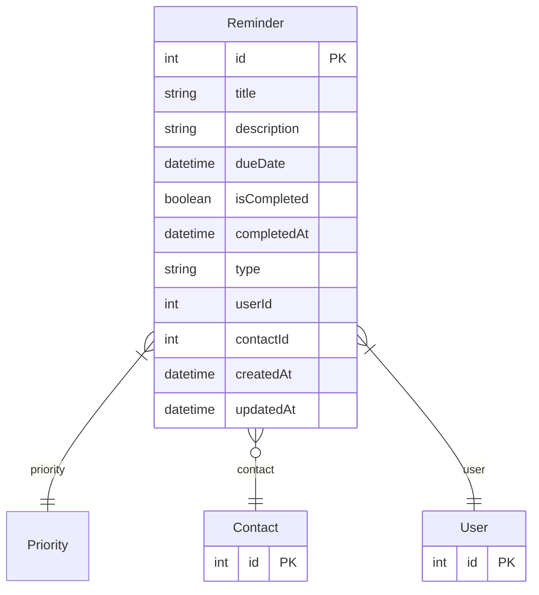

# Reminder

> Table name: `Reminder`

**Schema location:** Lines 2177-2194

## Fields

| Field | Type | Required | Unique | Default | Notes |
|-------|------|----------|--------|---------|-------|
| `id` | `Int` | ✅ | 🔑 PK | `autoincrement(` |  |
| `title` | `String` | ✅ |  | `` |  |
| `description` | `String?` | ❌ |  | `` |  |
| `dueDate` | `DateTime` | ✅ |  | `` |  |
| `isCompleted` | `Boolean` | ✅ |  | `false` |  |
| `completedAt` | `DateTime?` | ❌ |  | `` |  |
| `type` | `String` | ✅ |  | `"GENERAL"` |  |
| `userId` | `Int` | ✅ |  | `` |  |
| `contactId` | `Int?` | ❌ |  | `` |  |
| `createdAt` | `DateTime` | ✅ |  | `now(` |  |
| `updatedAt` | `DateTime` | ✅ |  | `` |  |

## Relations

| Field | Type | Cardinality | FK Fields | References | On Delete |
|-------|------|-------------|-----------|------------|-----------|
| `priority` | [Priority](./models/Priority.md) | Many-to-One | - | - | - |
| `contact` | [Contact](./models/Contact.md) | Many-to-One (optional) | contactId | id | - |
| `user` | [User](./models/User.md) | Many-to-One | userId | id | Cascade |

## Referenced By

| Model | Field | Cardinality |
|-------|-------|-------------|
| [User](./models/User.md) | `reminders` | Has many |
| [Contact](./models/Contact.md) | `reminders` | Has many |

## Entity Diagram

