# ReplenishmentSuggestion

> Table name: `replenishment_suggestions`

**Schema location:** Lines 7569-7600

## Fields

| Field | Type | Required | Unique | Default | Notes |
|-------|------|----------|--------|---------|-------|
| `id` | `Int` | ✅ | 🔑 PK | `autoincrement(` |  |
| `supplierItemId` | `Int` | ✅ |  | `` |  |
| `proveedorSugerido` | `Int?` | ❌ |  | `` |  |
| `warehouseId` | `Int` | ✅ |  | `` |  |
| `cantidadSugerida` | `Decimal` | ✅ |  | `` | DB: Decimal(15, 4) |
| `cantidadActual` | `Decimal` | ✅ |  | `` | DB: Decimal(15, 4) |
| `stockMinimo` | `Decimal` | ✅ |  | `` | DB: Decimal(15, 4) |
| `consumoPromedio` | `Decimal?` | ❌ |  | `` | DB: Decimal(15, 4). Consumo promedio diario/semanal |
| `leadTimeEstimado` | `Int?` | ❌ |  | `` | Días estimados de entrega |
| `motivo` | `String?` | ❌ |  | `` |  |
| `purchaseOrderId` | `Int?` | ❌ |  | `` | Si se generó OC |
| `ignorada` | `Boolean` | ✅ |  | `false` |  |
| `ignoradaPor` | `Int?` | ❌ |  | `` |  |
| `ignoradaMotivo` | `String?` | ❌ |  | `` |  |
| `companyId` | `Int` | ✅ |  | `` | Tracking |
| `createdAt` | `DateTime` | ✅ |  | `now(` |  |
| `expiresAt` | `DateTime?` | ❌ |  | `` | Cuando expira la sugerencia |
| `proveedor` | `suppliers?` | ❌ |  | `` |  |

## Relations

| Field | Type | Cardinality | FK Fields | References | On Delete |
|-------|------|-------------|-----------|------------|-----------|
| `urgencia` | [ReplenishmentUrgency](./models/ReplenishmentUrgency.md) | Many-to-One | - | - | - |
| `estado` | [ReplenishmentStatus](./models/ReplenishmentStatus.md) | Many-to-One | - | - | - |
| `supplierItem` | [SupplierItem](./models/SupplierItem.md) | Many-to-One | supplierItemId | id | - |

## Referenced By

| Model | Field | Cardinality |
|-------|-------|-------------|
| [suppliers](./models/suppliers.md) | `replenishmentSuggestions` | Has many |
| [SupplierItem](./models/SupplierItem.md) | `replenishmentSuggestions` | Has many |

## Indexes

- `companyId`
- `estado`
- `urgencia`
- `supplierItemId`

## Entity Diagram

```mermaid
erDiagram
    ReplenishmentSuggestion {
        int id PK
        int supplierItemId
        int proveedorSugerido
        int warehouseId
        decimal cantidadSugerida
        decimal cantidadActual
        decimal stockMinimo
        decimal consumoPromedio
        int leadTimeEstimado
        string motivo
        int purchaseOrderId
        boolean ignorada
        int ignoradaPor
        string ignoradaMotivo
        int companyId
        string _more_fields
    }
    SupplierItem {
        int id PK
    }
    suppliers {
        int id PK
    }
    ReplenishmentSuggestion }|--|| ReplenishmentUrgency : "urgencia"
    ReplenishmentSuggestion }|--|| ReplenishmentStatus : "estado"
    ReplenishmentSuggestion }|--|| SupplierItem : "supplierItem"
```

