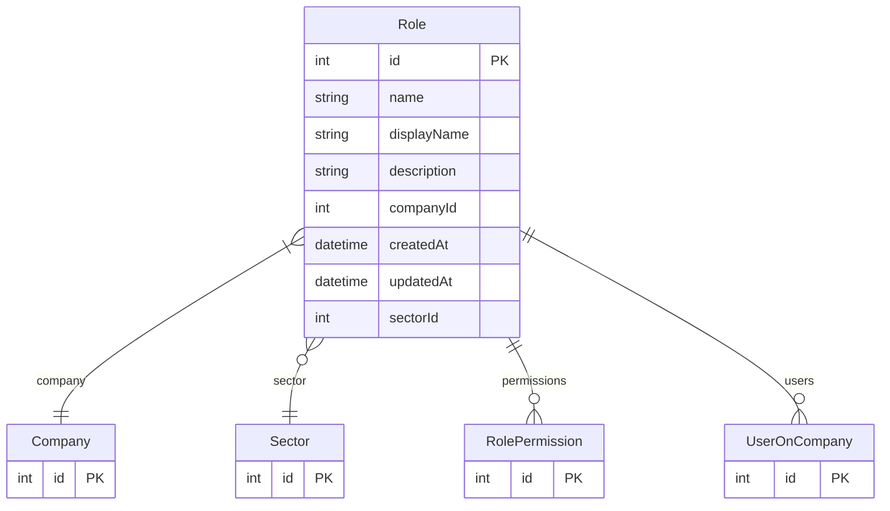

# Role

> Table name: `Role`

**Schema location:** Lines 693-709

## Fields

| Field | Type | Required | Unique | Default | Notes |
|-------|------|----------|--------|---------|-------|
| `id` | `Int` | ✅ | 🔑 PK | `autoincrement(` |  |
| `name` | `String` | ✅ |  | `` |  |
| `displayName` | `String` | ✅ |  | `` |  |
| `description` | `String?` | ❌ |  | `` |  |
| `companyId` | `Int` | ✅ |  | `` |  |
| `createdAt` | `DateTime` | ✅ |  | `now(` |  |
| `updatedAt` | `DateTime` | ✅ |  | `` |  |
| `sectorId` | `Int?` | ❌ |  | `` |  |

## Relations

| Field | Type | Cardinality | FK Fields | References | On Delete |
|-------|------|-------------|-----------|------------|-----------|
| `company` | [Company](./models/Company.md) | Many-to-One | companyId | id | Cascade |
| `sector` | [Sector](./models/Sector.md) | Many-to-One (optional) | sectorId | id | - |
| `permissions` | [RolePermission](./models/RolePermission.md) | One-to-Many | - | - | - |
| `users` | [UserOnCompany](./models/UserOnCompany.md) | One-to-Many | - | - | - |

## Referenced By

| Model | Field | Cardinality |
|-------|-------|-------------|
| [Company](./models/Company.md) | `roles` | Has many |
| [UserOnCompany](./models/UserOnCompany.md) | `role` | Has one |
| [Sector](./models/Sector.md) | `roles` | Has many |
| [RolePermission](./models/RolePermission.md) | `role` | Has one |

## Unique Constraints

- `companyId, name`

## Entity Diagram

