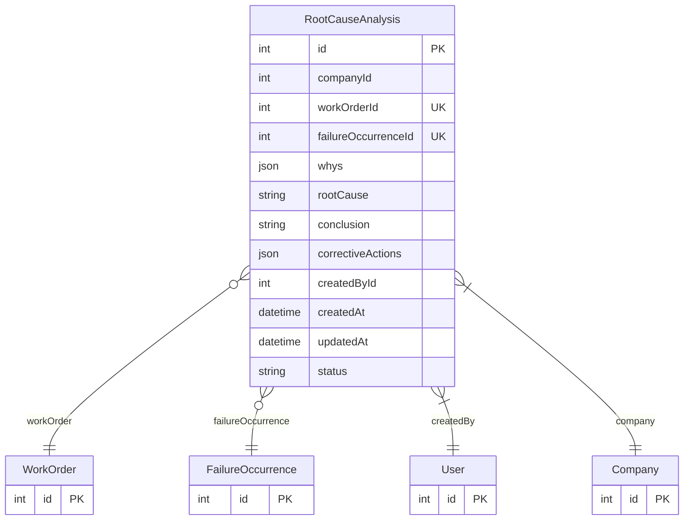

# RootCauseAnalysis

> Table name: `root_cause_analyses`

**Schema location:** Lines 5885-5914

## Fields

| Field | Type | Required | Unique | Default | Notes |
|-------|------|----------|--------|---------|-------|
| `id` | `Int` | ✅ | 🔑 PK | `autoincrement(` |  |
| `companyId` | `Int` | ✅ |  | `` |  |
| `workOrderId` | `Int?` | ❌ | ✅ | `` |  |
| `failureOccurrenceId` | `Int?` | ❌ | ✅ | `` |  |
| `whys` | `Json` | ✅ |  | `` | [{level: 1, question: "¿Por qué?", answer: "..."}] |
| `rootCause` | `String?` | ❌ |  | `` | DB: Text. Causa raíz identificada |
| `conclusion` | `String?` | ❌ |  | `` | DB: Text. Conclusión del análisis |
| `correctiveActions` | `Json?` | ❌ |  | `` | [{action, responsible, dueDate, status}] |
| `createdById` | `Int` | ✅ |  | `` | Metadata |
| `createdAt` | `DateTime` | ✅ |  | `now(` |  |
| `updatedAt` | `DateTime` | ✅ |  | `` |  |
| `status` | `String` | ✅ |  | `"DRAFT"` | DB: VarChar(20). DRAFT, COMPLETED, REVIEWED |

## Relations

| Field | Type | Cardinality | FK Fields | References | On Delete |
|-------|------|-------------|-----------|------------|-----------|
| `workOrder` | [WorkOrder](./models/WorkOrder.md) | Many-to-One (optional) | workOrderId | id | Cascade |
| `failureOccurrence` | [FailureOccurrence](./models/FailureOccurrence.md) | Many-to-One (optional) | failureOccurrenceId | id | Cascade |
| `createdBy` | [User](./models/User.md) | Many-to-One | createdById | id | - |
| `company` | [Company](./models/Company.md) | Many-to-One | companyId | id | Cascade |

## Referenced By

| Model | Field | Cardinality |
|-------|-------|-------------|
| [Company](./models/Company.md) | `rootCauseAnalyses` | Has many |
| [User](./models/User.md) | `rcaCreated` | Has many |
| [WorkOrder](./models/WorkOrder.md) | `rootCauseAnalysis` | Has one |
| [FailureOccurrence](./models/FailureOccurrence.md) | `rootCauseAnalysis` | Has one |

## Indexes

- `companyId, workOrderId`
- `failureOccurrenceId`

## Entity Diagram

