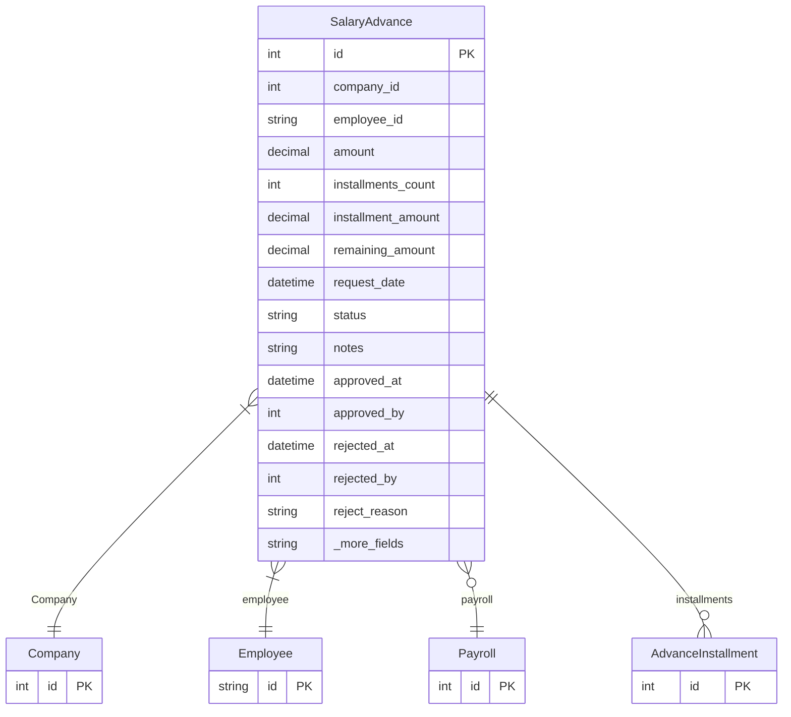

# SalaryAdvance

> Table name: `salary_advances`

**Schema location:** Lines 11874-11903

## Fields

| Field | Type | Required | Unique | Default | Notes |
|-------|------|----------|--------|---------|-------|
| `id` | `Int` | ✅ | 🔑 PK | `autoincrement(` |  |
| `company_id` | `Int` | ✅ |  | `` |  |
| `employee_id` | `String` | ✅ |  | `` | DB: VarChar(255) |
| `amount` | `Decimal` | ✅ |  | `` | DB: Decimal(12, 2) |
| `installments_count` | `Int` | ✅ |  | `1` |  |
| `installment_amount` | `Decimal` | ✅ |  | `` | DB: Decimal(12, 2) |
| `remaining_amount` | `Decimal` | ✅ |  | `` | DB: Decimal(12, 2) |
| `request_date` | `DateTime` | ✅ |  | `now(` |  |
| `status` | `String` | ✅ |  | `"PENDING"` | DB: VarChar(20). PENDING, APPROVED, ACTIVE, COMPLETED, REJECTED, CANCELLED |
| `notes` | `String?` | ❌ |  | `` |  |
| `approved_at` | `DateTime?` | ❌ |  | `` |  |
| `approved_by` | `Int?` | ❌ |  | `` |  |
| `rejected_at` | `DateTime?` | ❌ |  | `` |  |
| `rejected_by` | `Int?` | ❌ |  | `` |  |
| `reject_reason` | `String?` | ❌ |  | `` |  |
| `payroll_id` | `Int?` | ❌ |  | `` |  |
| `created_at` | `DateTime` | ✅ |  | `now(` |  |
| `updated_at` | `DateTime` | ✅ |  | `` |  |

## Relations

| Field | Type | Cardinality | FK Fields | References | On Delete |
|-------|------|-------------|-----------|------------|-----------|
| `Company` | [Company](./models/Company.md) | Many-to-One | company_id | id | Cascade |
| `employee` | [Employee](./models/Employee.md) | Many-to-One | employee_id | id | Cascade |
| `payroll` | [Payroll](./models/Payroll.md) | Many-to-One (optional) | payroll_id | id | SetNull |
| `installments` | [AdvanceInstallment](./models/AdvanceInstallment.md) | One-to-Many | - | - | - |

## Referenced By

| Model | Field | Cardinality |
|-------|-------|-------------|
| [Company](./models/Company.md) | `salaryAdvances` | Has many |
| [Employee](./models/Employee.md) | `advances` | Has many |
| [Payroll](./models/Payroll.md) | `advances` | Has many |
| [AdvanceInstallment](./models/AdvanceInstallment.md) | `advance` | Has one |

## Indexes

- `company_id, status`
- `employee_id`
- `payroll_id`

## Entity Diagram

