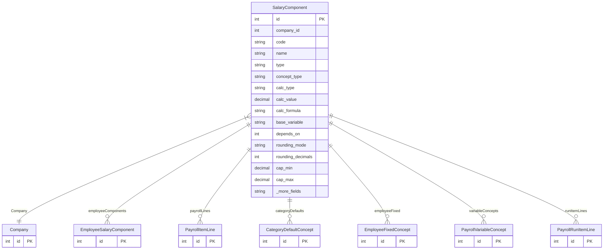

# SalaryComponent

> Table name: `salary_components`

**Schema location:** Lines 11662-11714

## Fields

| Field | Type | Required | Unique | Default | Notes |
|-------|------|----------|--------|---------|-------|
| `id` | `Int` | ✅ | 🔑 PK | `autoincrement(` |  |
| `company_id` | `Int` | ✅ |  | `` |  |
| `code` | `String` | ✅ |  | `` | DB: VarChar(50) |
| `name` | `String` | ✅ |  | `` | DB: VarChar(255) |
| `type` | `String` | ✅ |  | `` | DB: VarChar(20). EARNING | DEDUCTION | EMPLOYER_COST |
| `concept_type` | `String` | ✅ |  | `"CALCULATED"` | DB: VarChar(30). Tipo de concepto v4 |
| `calc_type` | `String` | ✅ |  | `` | DB: VarChar(20). FIXED | PERCENTAGE | FORMULA | DAYS_BASED |
| `calc_value` | `Decimal?` | ❌ |  | `` | DB: Decimal(12, 4) |
| `calc_formula` | `String?` | ❌ |  | `` |  |
| `base_variable` | `String` | ✅ |  | `"GROSS_REMUNERATIVE"` | DB: VarChar(30) |
| `depends_on` | `Int[]` | ✅ |  | `[]` | IDs de componentes (validados) |
| `rounding_mode` | `String` | ✅ |  | `"HALF_UP"` | DB: VarChar(20) |
| `rounding_decimals` | `Int` | ✅ |  | `2` |  |
| `cap_min` | `Decimal?` | ❌ |  | `` | DB: Decimal(12, 2) |
| `cap_max` | `Decimal?` | ❌ |  | `` | DB: Decimal(12, 2) |
| `is_remunerative` | `Boolean` | ✅ |  | `true` | Remunerativo vs No remunerativo |
| `affects_employee_contrib` | `Boolean` | ✅ |  | `true` | Base para aportes empleado |
| `affects_employer_contrib` | `Boolean` | ✅ |  | `true` | Base para contribuciones empleador |
| `affects_income_tax` | `Boolean` | ✅ |  | `false` | Base para ganancias (futuro) |
| `is_taxable` | `Boolean` | ✅ |  | `true` |  |
| `is_active` | `Boolean` | ✅ |  | `true` |  |
| `apply_to` | `String` | ✅ |  | `"ALL"` | DB: VarChar(100) |
| `prorate_on_partial` | `Boolean` | ✅ |  | `true` |  |
| `order` | `Int` | ✅ |  | `0` |  |
| `created_at` | `DateTime` | ✅ |  | `now(` |  |
| `updated_at` | `DateTime` | ✅ |  | `` |  |

## Relations

| Field | Type | Cardinality | FK Fields | References | On Delete |
|-------|------|-------------|-----------|------------|-----------|
| `Company` | [Company](./models/Company.md) | Many-to-One | company_id | id | Cascade |
| `employeeComponents` | [EmployeeSalaryComponent](./models/EmployeeSalaryComponent.md) | One-to-Many | - | - | - |
| `payrollLines` | [PayrollItemLine](./models/PayrollItemLine.md) | One-to-Many | - | - | - |
| `categoryDefaults` | [CategoryDefaultConcept](./models/CategoryDefaultConcept.md) | One-to-Many | - | - | - |
| `employeeFixed` | [EmployeeFixedConcept](./models/EmployeeFixedConcept.md) | One-to-Many | - | - | - |
| `variableConcepts` | [PayrollVariableConcept](./models/PayrollVariableConcept.md) | One-to-Many | - | - | - |
| `runItemLines` | [PayrollRunItemLine](./models/PayrollRunItemLine.md) | One-to-Many | - | - | - |

## Referenced By

| Model | Field | Cardinality |
|-------|-------|-------------|
| [Company](./models/Company.md) | `salaryComponents` | Has many |
| [EmployeeSalaryComponent](./models/EmployeeSalaryComponent.md) | `component` | Has one |
| [PayrollItemLine](./models/PayrollItemLine.md) | `component` | Has one |
| [CategoryDefaultConcept](./models/CategoryDefaultConcept.md) | `component` | Has one |
| [EmployeeFixedConcept](./models/EmployeeFixedConcept.md) | `component` | Has one |
| [PayrollVariableConcept](./models/PayrollVariableConcept.md) | `component` | Has one |
| [PayrollRunItemLine](./models/PayrollRunItemLine.md) | `component` | Has one |

## Indexes

- `company_id, is_active`

## Unique Constraints

- `company_id, code`

## Entity Diagram

