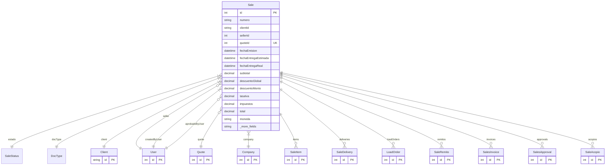

# Sale

> Table name: `sales`

**Schema location:** Lines 9158-9243

## Fields

| Field | Type | Required | Unique | Default | Notes |
|-------|------|----------|--------|---------|-------|
| `id` | `Int` | ✅ | 🔑 PK | `autoincrement(` |  |
| `numero` | `String` | ✅ |  | `` | DB: VarChar(50) |
| `clientId` | `String` | ✅ |  | `` |  |
| `sellerId` | `Int?` | ❌ |  | `` |  |
| `quoteId` | `Int?` | ❌ | ✅ | `` |  |
| `fechaEmision` | `DateTime` | ✅ |  | `` | DB: Date. Fechas |
| `fechaEntregaEstimada` | `DateTime?` | ❌ |  | `` | DB: Date |
| `fechaEntregaReal` | `DateTime?` | ❌ |  | `` | DB: Date |
| `subtotal` | `Decimal` | ✅ |  | `` | DB: Decimal(15, 2). Montos |
| `descuentoGlobal` | `Decimal` | ✅ |  | `0` | DB: Decimal(5, 2) |
| `descuentoMonto` | `Decimal` | ✅ |  | `0` | DB: Decimal(15, 2) |
| `tasaIva` | `Decimal` | ✅ |  | `21` | DB: Decimal(5, 2) |
| `impuestos` | `Decimal` | ✅ |  | `0` | DB: Decimal(15, 2) |
| `total` | `Decimal` | ✅ |  | `` | DB: Decimal(15, 2) |
| `moneda` | `String` | ✅ |  | `"ARS"` | DB: VarChar(10) |
| `condicionesPago` | `String?` | ❌ |  | `` | DB: VarChar(255). Condiciones |
| `diasPlazo` | `Int?` | ❌ |  | `` |  |
| `lugarEntrega` | `String?` | ❌ |  | `` |  |
| `notas` | `String?` | ❌ |  | `` | Notas |
| `notasInternas` | `String?` | ❌ |  | `` |  |
| `requiereAprobacion` | `Boolean` | ✅ |  | `false` | Aprobación |
| `aprobadoPor` | `Int?` | ❌ |  | `` |  |
| `aprobadoAt` | `DateTime?` | ❌ |  | `` |  |
| `comisionPorcentaje` | `Decimal?` | ❌ |  | `` | DB: Decimal(5, 2). Comisión |
| `comisionMonto` | `Decimal?` | ❌ |  | `` | DB: Decimal(15, 2) |
| `comisionPagada` | `Boolean` | ✅ |  | `false` |  |
| `comisionPagadaAt` | `DateTime?` | ❌ |  | `` |  |
| `costoTotal` | `Decimal?` | ❌ |  | `` | DB: Decimal(15, 2). Rentabilidad (solo visible con permiso) |
| `margenBruto` | `Decimal?` | ❌ |  | `` | DB: Decimal(15, 2) |
| `margenPorcentaje` | `Decimal?` | ❌ |  | `` | DB: Decimal(5, 2) |
| `companyId` | `Int` | ✅ |  | `` | Tracking |
| `createdBy` | `Int` | ✅ |  | `` |  |
| `createdAt` | `DateTime` | ✅ |  | `now(` |  |
| `updatedAt` | `DateTime` | ✅ |  | `` |  |

## Relations

| Field | Type | Cardinality | FK Fields | References | On Delete |
|-------|------|-------------|-----------|------------|-----------|
| `estado` | [SaleStatus](./models/SaleStatus.md) | Many-to-One | - | - | - |
| `docType` | [DocType](./models/DocType.md) | Many-to-One | - | - | - |
| `client` | [Client](./models/Client.md) | Many-to-One | clientId | id | - |
| `seller` | [User](./models/User.md) | Many-to-One (optional) | sellerId | id | - |
| `quote` | [Quote](./models/Quote.md) | Many-to-One (optional) | quoteId | id | - |
| `company` | [Company](./models/Company.md) | Many-to-One | companyId | id | Cascade |
| `createdByUser` | [User](./models/User.md) | Many-to-One | createdBy | id | - |
| `aprobadoByUser` | [User](./models/User.md) | Many-to-One (optional) | aprobadoPor | id | - |
| `items` | [SaleItem](./models/SaleItem.md) | One-to-Many | - | - | - |
| `deliveries` | [SaleDelivery](./models/SaleDelivery.md) | One-to-Many | - | - | - |
| `loadOrders` | [LoadOrder](./models/LoadOrder.md) | One-to-Many | - | - | - |
| `remitos` | [SaleRemito](./models/SaleRemito.md) | One-to-Many | - | - | - |
| `invoices` | [SalesInvoice](./models/SalesInvoice.md) | One-to-Many | - | - | - |
| `approvals` | [SalesApproval](./models/SalesApproval.md) | One-to-Many | - | - | - |
| `acopios` | [SaleAcopio](./models/SaleAcopio.md) | One-to-Many | - | - | - |

## Referenced By

| Model | Field | Cardinality |
|-------|-------|-------------|
| [Company](./models/Company.md) | `sales` | Has many |
| [User](./models/User.md) | `salesAsSeller` | Has many |
| [User](./models/User.md) | `salesCreated` | Has many |
| [User](./models/User.md) | `salesApproved` | Has many |
| [Client](./models/Client.md) | `sales` | Has many |
| [Quote](./models/Quote.md) | `sale` | Has one |
| [SaleItem](./models/SaleItem.md) | `sale` | Has one |
| [SaleDelivery](./models/SaleDelivery.md) | `sale` | Has one |
| [LoadOrder](./models/LoadOrder.md) | `sale` | Has one |
| [SaleRemito](./models/SaleRemito.md) | `sale` | Has one |
| [SalesInvoice](./models/SalesInvoice.md) | `sale` | Has one |
| [SalesApproval](./models/SalesApproval.md) | `sale` | Has one |
| [SaleAcopio](./models/SaleAcopio.md) | `sale` | Has one |

## Indexes

- `companyId`
- `clientId`
- `sellerId`
- `estado`
- `fechaEmision`
- `docType`
- `companyId, docType`
- `companyId, docType, fechaEmision`
- `companyId, clientId, docType`
- `companyId, sellerId, docType`
- `clientId, estado`

## Unique Constraints

- `companyId, numero`

## Entity Diagram

