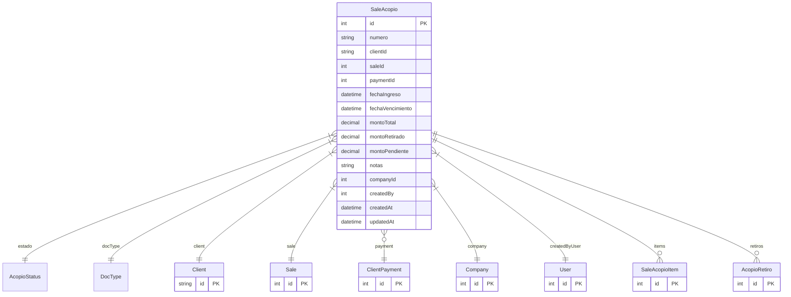

# SaleAcopio

> Table name: `sale_acopios`

**Schema location:** Lines 10454-10497

## Fields

| Field | Type | Required | Unique | Default | Notes |
|-------|------|----------|--------|---------|-------|
| `id` | `Int` | ✅ | 🔑 PK | `autoincrement(` |  |
| `numero` | `String` | ✅ |  | `` | DB: VarChar(50) |
| `clientId` | `String` | ✅ |  | `` |  |
| `saleId` | `Int` | ✅ |  | `` |  |
| `paymentId` | `Int?` | ❌ |  | `` | Pago que generó el acopio |
| `fechaIngreso` | `DateTime` | ✅ |  | `` | DB: Date. Fechas |
| `fechaVencimiento` | `DateTime?` | ❌ |  | `` | DB: Date |
| `montoTotal` | `Decimal` | ✅ |  | `` | DB: Decimal(15, 2). Montos |
| `montoRetirado` | `Decimal` | ✅ |  | `0` | DB: Decimal(15, 2) |
| `montoPendiente` | `Decimal` | ✅ |  | `` | DB: Decimal(15, 2) |
| `notas` | `String?` | ❌ |  | `` | Información adicional |
| `companyId` | `Int` | ✅ |  | `` | Tracking |
| `createdBy` | `Int` | ✅ |  | `` |  |
| `createdAt` | `DateTime` | ✅ |  | `now(` |  |
| `updatedAt` | `DateTime` | ✅ |  | `` |  |

## Relations

| Field | Type | Cardinality | FK Fields | References | On Delete |
|-------|------|-------------|-----------|------------|-----------|
| `estado` | [AcopioStatus](./models/AcopioStatus.md) | Many-to-One | - | - | - |
| `docType` | [DocType](./models/DocType.md) | Many-to-One | - | - | - |
| `client` | [Client](./models/Client.md) | Many-to-One | clientId | id | - |
| `sale` | [Sale](./models/Sale.md) | Many-to-One | saleId | id | - |
| `payment` | [ClientPayment](./models/ClientPayment.md) | Many-to-One (optional) | paymentId | id | - |
| `company` | [Company](./models/Company.md) | Many-to-One | companyId | id | Cascade |
| `createdByUser` | [User](./models/User.md) | Many-to-One | createdBy | id | - |
| `items` | [SaleAcopioItem](./models/SaleAcopioItem.md) | One-to-Many | - | - | - |
| `retiros` | [AcopioRetiro](./models/AcopioRetiro.md) | One-to-Many | - | - | - |

## Referenced By

| Model | Field | Cardinality |
|-------|-------|-------------|
| [Company](./models/Company.md) | `saleAcopios` | Has many |
| [User](./models/User.md) | `acopiosCreated` | Has many |
| [Client](./models/Client.md) | `acopios` | Has many |
| [Sale](./models/Sale.md) | `acopios` | Has many |
| [ClientPayment](./models/ClientPayment.md) | `acopios` | Has many |
| [SaleAcopioItem](./models/SaleAcopioItem.md) | `acopio` | Has one |
| [AcopioRetiro](./models/AcopioRetiro.md) | `acopio` | Has one |

## Indexes

- `companyId`
- `clientId`
- `saleId`
- `estado`
- `fechaVencimiento`

## Unique Constraints

- `companyId, numero`

## Entity Diagram

