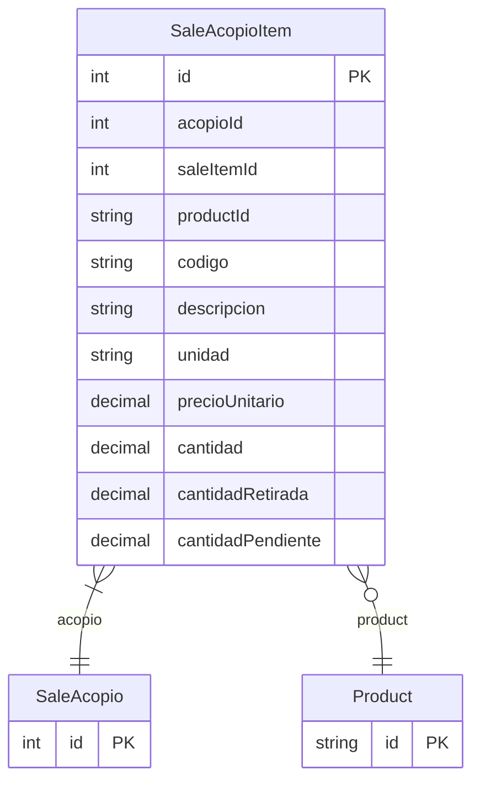

# SaleAcopioItem

> Table name: `sale_acopio_items`

**Schema location:** Lines 10500-10521

## Fields

| Field | Type | Required | Unique | Default | Notes |
|-------|------|----------|--------|---------|-------|
| `id` | `Int` | ✅ | 🔑 PK | `autoincrement(` |  |
| `acopioId` | `Int` | ✅ |  | `` |  |
| `saleItemId` | `Int?` | ❌ |  | `` |  |
| `productId` | `String?` | ❌ |  | `` |  |
| `codigo` | `String?` | ❌ |  | `` | DB: VarChar(50) |
| `descripcion` | `String` | ✅ |  | `` | DB: VarChar(500) |
| `unidad` | `String` | ✅ |  | `` | DB: VarChar(50) |
| `precioUnitario` | `Decimal` | ✅ |  | `` | DB: Decimal(15, 2) |
| `cantidad` | `Decimal` | ✅ |  | `` | DB: Decimal(15, 4). Cantidades |
| `cantidadRetirada` | `Decimal` | ✅ |  | `0` | DB: Decimal(15, 4) |
| `cantidadPendiente` | `Decimal` | ✅ |  | `` | DB: Decimal(15, 4) |

## Relations

| Field | Type | Cardinality | FK Fields | References | On Delete |
|-------|------|-------------|-----------|------------|-----------|
| `acopio` | [SaleAcopio](./models/SaleAcopio.md) | Many-to-One | acopioId | id | Cascade |
| `product` | [Product](./models/Product.md) | Many-to-One (optional) | productId | id | - |

## Referenced By

| Model | Field | Cardinality |
|-------|-------|-------------|
| [Product](./models/Product.md) | `acopioItems` | Has many |
| [SaleAcopio](./models/SaleAcopio.md) | `items` | Has many |

## Indexes

- `acopioId`
- `productId`

## Entity Diagram

