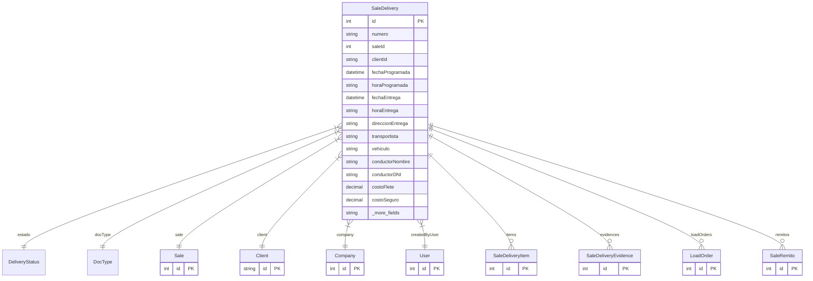

# SaleDelivery

> Table name: `sale_deliveries`

**Schema location:** Lines 9275-9341

## Fields

| Field | Type | Required | Unique | Default | Notes |
|-------|------|----------|--------|---------|-------|
| `id` | `Int` | ✅ | 🔑 PK | `autoincrement(` |  |
| `numero` | `String` | ✅ |  | `` | DB: VarChar(50) |
| `saleId` | `Int` | ✅ |  | `` |  |
| `clientId` | `String` | ✅ |  | `` |  |
| `fechaProgramada` | `DateTime?` | ❌ |  | `` | DB: Date. Programación |
| `horaProgramada` | `String?` | ❌ |  | `` | DB: VarChar(20) |
| `fechaEntrega` | `DateTime?` | ❌ |  | `` | DB: Date |
| `horaEntrega` | `String?` | ❌ |  | `` | DB: VarChar(20) |
| `direccionEntrega` | `String?` | ❌ |  | `` | Dirección |
| `transportista` | `String?` | ❌ |  | `` | DB: VarChar(255). Transporte y Costos |
| `vehiculo` | `String?` | ❌ |  | `` | DB: VarChar(100) |
| `conductorNombre` | `String?` | ❌ |  | `` | DB: VarChar(255) |
| `conductorDNI` | `String?` | ❌ |  | `` | DB: VarChar(20) |
| `costoFlete` | `Decimal?` | ❌ |  | `` | DB: Decimal(15, 2) |
| `costoSeguro` | `Decimal?` | ❌ |  | `` | DB: Decimal(15, 2) |
| `otrosCostos` | `Decimal?` | ❌ |  | `` | DB: Decimal(15, 2) |
| `recibeNombre` | `String?` | ❌ |  | `` | DB: VarChar(255). Recepción |
| `recibeDNI` | `String?` | ❌ |  | `` | DB: VarChar(20) |
| `firmaRecepcion` | `String?` | ❌ |  | `` |  |
| `latitudEntrega` | `Decimal?` | ❌ |  | `` | DB: Decimal(10, 8). GPS |
| `longitudEntrega` | `Decimal?` | ❌ |  | `` | DB: Decimal(11, 8) |
| `notas` | `String?` | ❌ |  | `` | Notas |
| `observacionesEntrega` | `String?` | ❌ |  | `` |  |
| `companyId` | `Int` | ✅ |  | `` | Tracking |
| `createdBy` | `Int` | ✅ |  | `` |  |
| `createdAt` | `DateTime` | ✅ |  | `now(` |  |
| `updatedAt` | `DateTime` | ✅ |  | `` |  |

## Relations

| Field | Type | Cardinality | FK Fields | References | On Delete |
|-------|------|-------------|-----------|------------|-----------|
| `estado` | [DeliveryStatus](./models/DeliveryStatus.md) | Many-to-One | - | - | - |
| `docType` | [DocType](./models/DocType.md) | Many-to-One | - | - | - |
| `sale` | [Sale](./models/Sale.md) | Many-to-One | saleId | id | - |
| `client` | [Client](./models/Client.md) | Many-to-One | clientId | id | - |
| `company` | [Company](./models/Company.md) | Many-to-One | companyId | id | Cascade |
| `createdByUser` | [User](./models/User.md) | Many-to-One | createdBy | id | - |
| `items` | [SaleDeliveryItem](./models/SaleDeliveryItem.md) | One-to-Many | - | - | - |
| `evidences` | [SaleDeliveryEvidence](./models/SaleDeliveryEvidence.md) | One-to-Many | - | - | - |
| `loadOrders` | [LoadOrder](./models/LoadOrder.md) | One-to-Many | - | - | - |
| `remitos` | [SaleRemito](./models/SaleRemito.md) | One-to-Many | - | - | - |

## Referenced By

| Model | Field | Cardinality |
|-------|-------|-------------|
| [Company](./models/Company.md) | `saleDeliveries` | Has many |
| [User](./models/User.md) | `deliveriesCreated` | Has many |
| [Client](./models/Client.md) | `deliveries` | Has many |
| [Sale](./models/Sale.md) | `deliveries` | Has many |
| [SaleDeliveryItem](./models/SaleDeliveryItem.md) | `delivery` | Has one |
| [SaleDeliveryEvidence](./models/SaleDeliveryEvidence.md) | `delivery` | Has one |
| [LoadOrder](./models/LoadOrder.md) | `delivery` | Has one |
| [SaleRemito](./models/SaleRemito.md) | `delivery` | Has one |

## Indexes

- `companyId`
- `saleId`
- `clientId`
- `estado`
- `fechaEntrega`
- `docType`
- `companyId, docType`

## Unique Constraints

- `companyId, numero`

## Entity Diagram

