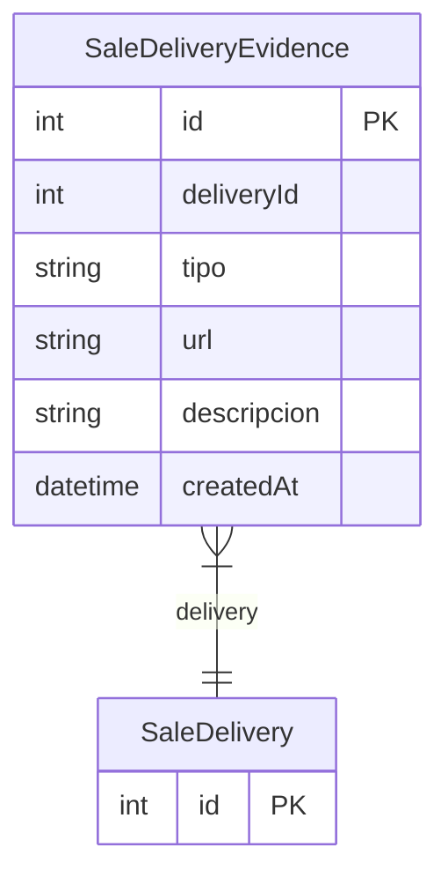

# SaleDeliveryEvidence

> Table name: `sale_delivery_evidences`

**Schema location:** Lines 9360-9372

## Fields

| Field | Type | Required | Unique | Default | Notes |
|-------|------|----------|--------|---------|-------|
| `id` | `Int` | ✅ | 🔑 PK | `autoincrement(` |  |
| `deliveryId` | `Int` | ✅ |  | `` |  |
| `tipo` | `String` | ✅ |  | `` | DB: VarChar(50). foto, firma, documento |
| `url` | `String` | ✅ |  | `` |  |
| `descripcion` | `String?` | ❌ |  | `` |  |
| `createdAt` | `DateTime` | ✅ |  | `now(` |  |

## Relations

| Field | Type | Cardinality | FK Fields | References | On Delete |
|-------|------|-------------|-----------|------------|-----------|
| `delivery` | [SaleDelivery](./models/SaleDelivery.md) | Many-to-One | deliveryId | id | Cascade |

## Referenced By

| Model | Field | Cardinality |
|-------|-------|-------------|
| [SaleDelivery](./models/SaleDelivery.md) | `evidences` | Has many |

## Indexes

- `deliveryId`

## Entity Diagram

