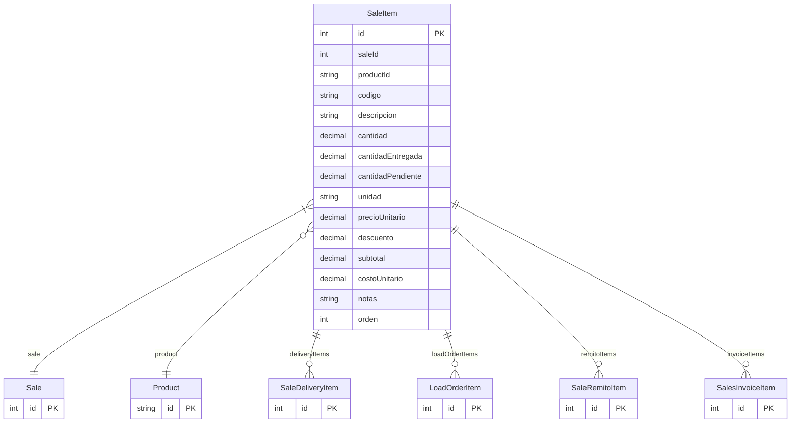

# SaleItem

> Table name: `sale_items`

**Schema location:** Lines 9245-9272

## Fields

| Field | Type | Required | Unique | Default | Notes |
|-------|------|----------|--------|---------|-------|
| `id` | `Int` | ✅ | 🔑 PK | `autoincrement(` |  |
| `saleId` | `Int` | ✅ |  | `` |  |
| `productId` | `String?` | ❌ |  | `` |  |
| `codigo` | `String?` | ❌ |  | `` | DB: VarChar(50) |
| `descripcion` | `String` | ✅ |  | `` | DB: VarChar(500) |
| `cantidad` | `Decimal` | ✅ |  | `` | DB: Decimal(15, 4) |
| `cantidadEntregada` | `Decimal` | ✅ |  | `0` | DB: Decimal(15, 4) |
| `cantidadPendiente` | `Decimal` | ✅ |  | `` | DB: Decimal(15, 4) |
| `unidad` | `String` | ✅ |  | `` | DB: VarChar(50) |
| `precioUnitario` | `Decimal` | ✅ |  | `` | DB: Decimal(15, 2) |
| `descuento` | `Decimal` | ✅ |  | `0` | DB: Decimal(5, 2) |
| `subtotal` | `Decimal` | ✅ |  | `` | DB: Decimal(15, 2) |
| `costoUnitario` | `Decimal?` | ❌ |  | `` | DB: Decimal(15, 2) |
| `notas` | `String?` | ❌ |  | `` |  |
| `orden` | `Int` | ✅ |  | `0` |  |

## Relations

| Field | Type | Cardinality | FK Fields | References | On Delete |
|-------|------|-------------|-----------|------------|-----------|
| `sale` | [Sale](./models/Sale.md) | Many-to-One | saleId | id | Cascade |
| `product` | [Product](./models/Product.md) | Many-to-One (optional) | productId | id | - |
| `deliveryItems` | [SaleDeliveryItem](./models/SaleDeliveryItem.md) | One-to-Many | - | - | - |
| `loadOrderItems` | [LoadOrderItem](./models/LoadOrderItem.md) | One-to-Many | - | - | - |
| `remitoItems` | [SaleRemitoItem](./models/SaleRemitoItem.md) | One-to-Many | - | - | - |
| `invoiceItems` | [SalesInvoiceItem](./models/SalesInvoiceItem.md) | One-to-Many | - | - | - |

## Referenced By

| Model | Field | Cardinality |
|-------|-------|-------------|
| [Product](./models/Product.md) | `saleItems` | Has many |
| [Sale](./models/Sale.md) | `items` | Has many |
| [SaleDeliveryItem](./models/SaleDeliveryItem.md) | `saleItem` | Has one |
| [LoadOrderItem](./models/LoadOrderItem.md) | `saleItem` | Has one |
| [SaleRemitoItem](./models/SaleRemitoItem.md) | `saleItem` | Has one |
| [SalesInvoiceItem](./models/SalesInvoiceItem.md) | `saleItem` | Has one |

## Indexes

- `saleId`
- `productId`

## Entity Diagram

