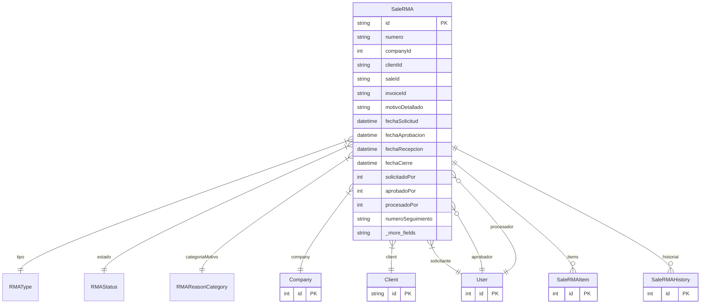

# SaleRMA

> Table name: `sale_rmas`

**Schema location:** Lines 10112-10173

## Fields

| Field | Type | Required | Unique | Default | Notes |
|-------|------|----------|--------|---------|-------|
| `id` | `String` | ✅ | 🔑 PK | `cuid(` |  |
| `numero` | `String` | ✅ |  | `` | RMA-00001 |
| `companyId` | `Int` | ✅ |  | `` |  |
| `clientId` | `String` | ✅ |  | `` |  |
| `saleId` | `String?` | ❌ |  | `` | Venta original (opcional) |
| `invoiceId` | `String?` | ❌ |  | `` | Factura original (opcional) |
| `motivoDetallado` | `String` | ✅ |  | `` | DB: Text |
| `fechaSolicitud` | `DateTime` | ✅ |  | `now(` | Fechas del proceso |
| `fechaAprobacion` | `DateTime?` | ❌ |  | `` |  |
| `fechaRecepcion` | `DateTime?` | ❌ |  | `` |  |
| `fechaCierre` | `DateTime?` | ❌ |  | `` |  |
| `solicitadoPor` | `Int` | ✅ |  | `` | Usuario que creó el RMA |
| `aprobadoPor` | `Int?` | ❌ |  | `` | Usuario que aprobó |
| `procesadoPor` | `Int?` | ❌ |  | `` | Usuario que procesó |
| `numeroSeguimiento` | `String?` | ❌ |  | `` | Información de envío |
| `transportista` | `String?` | ❌ |  | `` |  |
| `estadoProducto` | `String?` | ❌ |  | `` | NUEVO, USADO, DANADO, etc. |
| `notasEvaluacion` | `String?` | ❌ |  | `` | DB: Text |
| `fotoRecepcion` | `String[]` | ✅ |  | `` | URLs de fotos |
| `tipoResolucion` | `String?` | ❌ |  | `` | NC_EMITIDA, PRODUCTO_CAMBIADO, REPARADO, etc. |
| `creditNoteId` | `String?` | ❌ |  | `` | ID de nota de crédito generada |
| `nuevaVentaId` | `String?` | ❌ |  | `` | ID de nueva venta (si es cambio) |
| `montoDevuelto` | `Decimal?` | ❌ |  | `` | DB: Decimal(15, 2) |
| `documentType` | `String` | ✅ |  | `"N"` | Documentos |
| `docType` | `String` | ✅ |  | `"N"` |  |
| `createdAt` | `DateTime` | ✅ |  | `now(` |  |
| `updatedAt` | `DateTime` | ✅ |  | `` |  |

## Relations

| Field | Type | Cardinality | FK Fields | References | On Delete |
|-------|------|-------------|-----------|------------|-----------|
| `tipo` | [RMAType](./models/RMAType.md) | Many-to-One | - | - | - |
| `estado` | [RMAStatus](./models/RMAStatus.md) | Many-to-One | - | - | - |
| `categoriaMotivo` | [RMAReasonCategory](./models/RMAReasonCategory.md) | Many-to-One | - | - | - |
| `company` | [Company](./models/Company.md) | Many-to-One | companyId | id | Cascade |
| `client` | [Client](./models/Client.md) | Many-to-One | clientId | id | - |
| `solicitante` | [User](./models/User.md) | Many-to-One | solicitadoPor | id | - |
| `aprobador` | [User](./models/User.md) | Many-to-One (optional) | aprobadoPor | id | - |
| `procesador` | [User](./models/User.md) | Many-to-One (optional) | procesadoPor | id | - |
| `items` | [SaleRMAItem](./models/SaleRMAItem.md) | One-to-Many | - | - | - |
| `historial` | [SaleRMAHistory](./models/SaleRMAHistory.md) | One-to-Many | - | - | - |

## Referenced By

| Model | Field | Cardinality |
|-------|-------|-------------|
| [Company](./models/Company.md) | `rmas` | Has many |
| [User](./models/User.md) | `rmasSolicitadas` | Has many |
| [User](./models/User.md) | `rmasAprobadas` | Has many |
| [User](./models/User.md) | `rmasProcesadas` | Has many |
| [Client](./models/Client.md) | `rmas` | Has many |
| [SaleRMAItem](./models/SaleRMAItem.md) | `rma` | Has one |
| [SaleRMAHistory](./models/SaleRMAHistory.md) | `rma` | Has one |

## Indexes

- `companyId`
- `clientId`
- `estado`
- `fechaSolicitud`
- `numero`

## Entity Diagram

