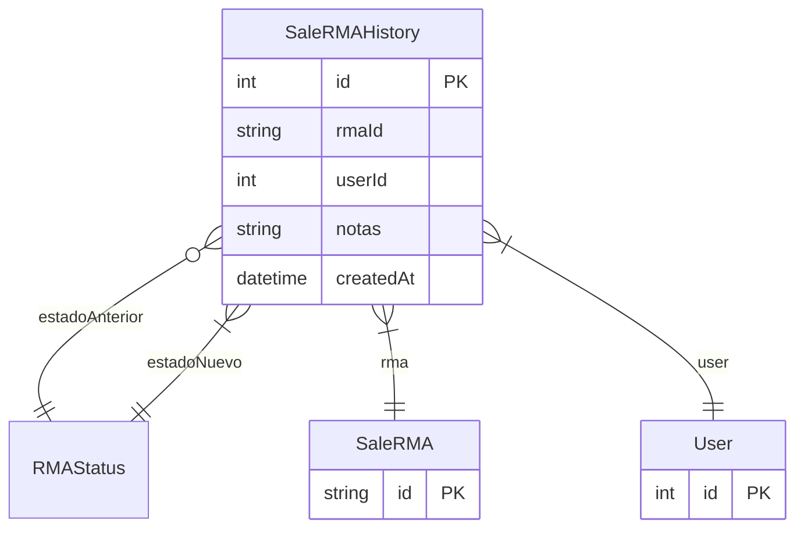

# SaleRMAHistory

> Table name: `sale_rma_history`

**Schema location:** Lines 10203-10218

## Fields

| Field | Type | Required | Unique | Default | Notes |
|-------|------|----------|--------|---------|-------|
| `id` | `Int` | ✅ | 🔑 PK | `autoincrement(` |  |
| `rmaId` | `String` | ✅ |  | `` |  |
| `userId` | `Int` | ✅ |  | `` |  |
| `notas` | `String?` | ❌ |  | `` | DB: Text |
| `createdAt` | `DateTime` | ✅ |  | `now(` |  |

## Relations

| Field | Type | Cardinality | FK Fields | References | On Delete |
|-------|------|-------------|-----------|------------|-----------|
| `estadoAnterior` | [RMAStatus](./models/RMAStatus.md) | Many-to-One (optional) | - | - | - |
| `estadoNuevo` | [RMAStatus](./models/RMAStatus.md) | Many-to-One | - | - | - |
| `rma` | [SaleRMA](./models/SaleRMA.md) | Many-to-One | rmaId | id | Cascade |
| `user` | [User](./models/User.md) | Many-to-One | userId | id | - |

## Referenced By

| Model | Field | Cardinality |
|-------|-------|-------------|
| [User](./models/User.md) | `rmaHistoryEvents` | Has many |
| [SaleRMA](./models/SaleRMA.md) | `historial` | Has many |

## Indexes

- `rmaId`
- `createdAt`

## Entity Diagram

