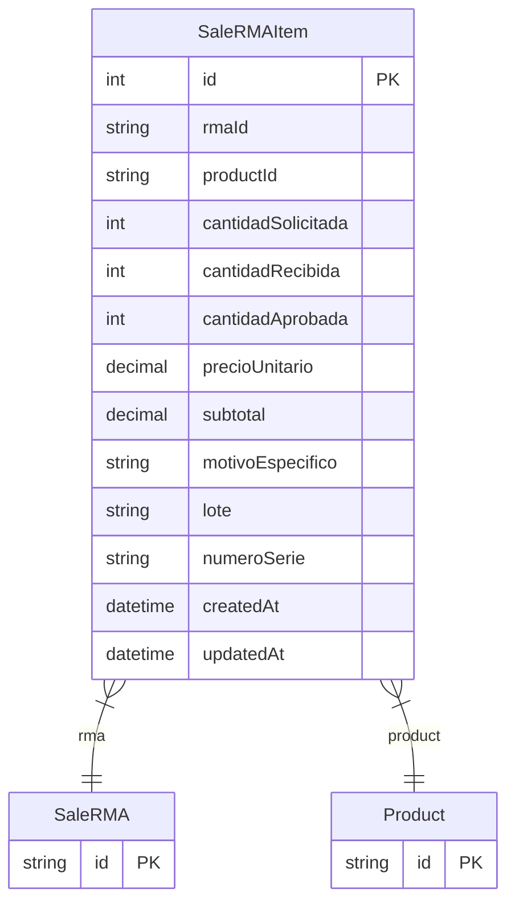

# SaleRMAItem

> Table name: `sale_rma_items`

**Schema location:** Lines 10176-10200

## Fields

| Field | Type | Required | Unique | Default | Notes |
|-------|------|----------|--------|---------|-------|
| `id` | `Int` | ✅ | 🔑 PK | `autoincrement(` |  |
| `rmaId` | `String` | ✅ |  | `` |  |
| `productId` | `String` | ✅ |  | `` |  |
| `cantidadSolicitada` | `Int` | ✅ |  | `` |  |
| `cantidadRecibida` | `Int` | ✅ |  | `0` |  |
| `cantidadAprobada` | `Int` | ✅ |  | `0` |  |
| `precioUnitario` | `Decimal` | ✅ |  | `` | DB: Decimal(15, 2) |
| `subtotal` | `Decimal` | ✅ |  | `` | DB: Decimal(15, 2) |
| `motivoEspecifico` | `String?` | ❌ |  | `` | DB: Text |
| `lote` | `String?` | ❌ |  | `` |  |
| `numeroSerie` | `String?` | ❌ |  | `` |  |
| `createdAt` | `DateTime` | ✅ |  | `now(` |  |
| `updatedAt` | `DateTime` | ✅ |  | `` |  |

## Relations

| Field | Type | Cardinality | FK Fields | References | On Delete |
|-------|------|-------------|-----------|------------|-----------|
| `rma` | [SaleRMA](./models/SaleRMA.md) | Many-to-One | rmaId | id | Cascade |
| `product` | [Product](./models/Product.md) | Many-to-One | productId | id | - |

## Referenced By

| Model | Field | Cardinality |
|-------|-------|-------------|
| [Product](./models/Product.md) | `rmaItems` | Has many |
| [SaleRMA](./models/SaleRMA.md) | `items` | Has many |

## Indexes

- `rmaId`
- `productId`

## Entity Diagram

